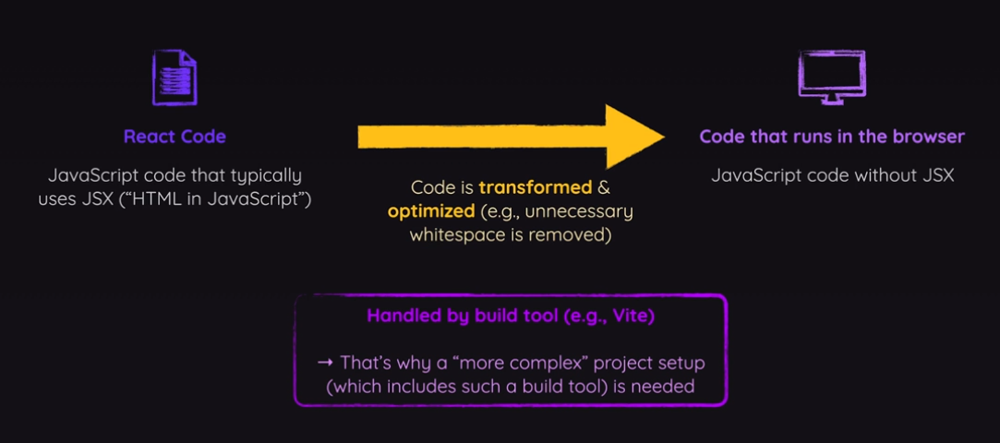
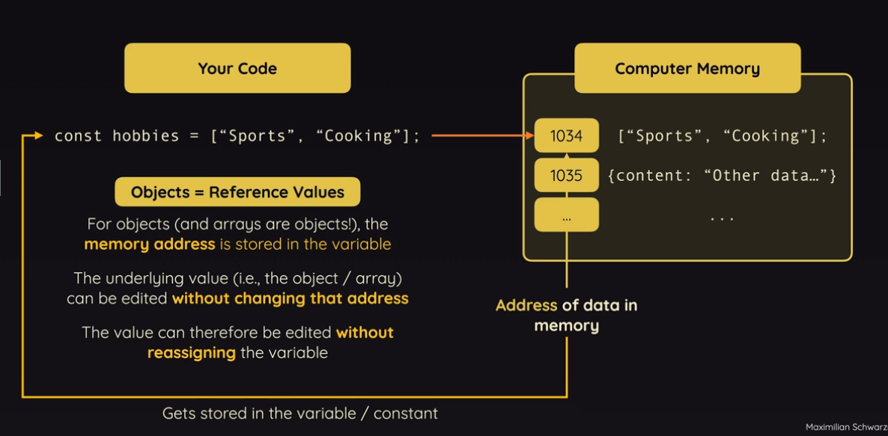
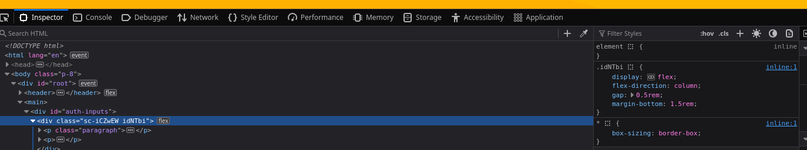
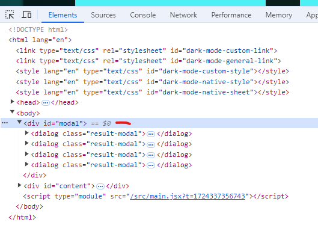
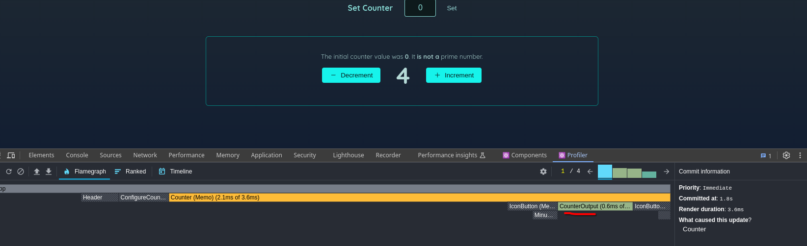
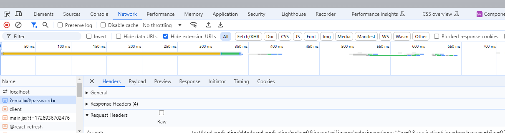

<!-- markdownlint-disable MD033 -->
<!-- markdownlint-disable MD024 -->
# React - The Complete Guide 2024 (incl. Next.js, Redux)

## Getting Started

### What is React.js?

**React.js is a JavaScript library for building user intefaces**.

As you navigate around React websites, you'll see that all these transitions are super smooth, pretty much instant, and you never have this effect where you seem to load a new page.

To some extent, it therefore feels like a mobile app, because in mobile apps, getting instant feedback and having smooth transitions is pretty much the standard.

#### Using "just JavaScript" typically isn't a great option

- writing complex JavaScript code quickly becomes cumbersome
- complex JavaCcript code quickly become error-prone
- complex JavaCcript code often is hard to maintain or edit

### ReactJS vs "Vanilla JavaScript"

With React, in the example provided, in that app.js file, we just got that HTML code with  dynamic elements blended into the HTML code. It defines different states of the different HTML elements, such as an active CSS class added to a button.

- React , you define the target UI states - not the steps to go there (Declarative)
- with JavaScript, you define the steps, not the goal (Imperative)

### Course Resources

**<span style='color: #a3842c'>Link:** [https://github.com/academind/react-complete-guide-course-resources](https://github.com/academind/react-complete-guide-course-resources)

### Creating React Projects

**<span style='color: #a3842c'>Link:** [Codesandbox_react](react.new)

---

if you prefer to use **VSCode** editor, you need to have installed *NodeJS*, as *ReactJS* uses tool such as *Vite*

**<span style='color: #a3842c'>Link:** [https://vitejs.dev/guide/](https://vitejs.dev/guide/)

`npm create vite@latest first_react_app -- --template react`

- `cd` into project
- `npm i`
- `npm run dev`

#### ESLINT

By using `npm create vite...` above, you also enable **eslinting**.

**<span style='color: #a3842c'>Link:** [https://eslint.org/docs/latest/use/getting-started](https://eslint.org/docs/latest/use/getting-started)

#### JavaScript in Visual Studio Code

- param

```javascript
export default function Signup() {
  /**
   * @param {Event} event
   */
  const handleSubmit = (event) => {
    event.preventDefault();
    // ...
  }
// ...
}
```
- local variable

```javascript
const handleSubmit = (event) => {
  event.preventDefault();
  /**
   @type {string}
    */
  const enteredEmail = email.current.value;
  const enteredPassword = password.current.value;

  const emailIsInvalid = !enteredEmail.includes('@');
  console.info(enteredEmail, enteredPassword);
};
```

**<span style='color: #a3842c'>Link:** [https://code.visualstudio.com/Docs/languages/javascript#_intellisense] (<https://code.visualstudio.com/Docs/languages/javascript#_intellisense>)

**<span style='color: #a3842c'>Link:** [https://jsdoc.app/](https://jsdoc.app/)

### Why do we need a special project setup?

Because when writing React code,

you'll use this special HTML in JavaScript feature, this syntax is called **JSX**.

It unfortunately doesn't work in the browser, So therefore the code you write actually must be transformed to code that does run in the browser.



That's the reason why you need to create React projects with extra tools like *Vite*.

because it's those tools which do transform your code to code that can be executed efficiently in the browser.

That's why you can't just create a basic HTML and script file but why you instead do need those extra tools.

## JavaScript Refresher

### Adding JavaScript to a Page & How React Projects differ

#### JavaScript can be executed in many environments


#### Adding JavaScript Code to a Website

- between `<script>` tags
- via `<script>` **Import**

`<script src="assets/scripts/app.js" defer type="module"></script>` unlocks 1 very important syntax: *ES6 Import* syntax.

**<span style='color: #495fcb'> Note:** when you're working on a React project, you will almost never add these script tags to your HTML file on your own, because React projects almost always use a build process which as part of that build process, injects these script tags into the HTML code for you.

### React Projects use a Build Process

`react-scripts` package provides a bunch of tools that take your code and transform it behind the scenes before it's then injected into the browser. Or to be precise, before it's then injected with help of a script tag into the HTML file.

if you inspect a web page, you can find script elements, generated and injected into this HTML file automatically behind the scenes by this built process that's running in the background.

#### Your code is transformed before it's handed off to the browser / Why React projects typically require a build process that transforms your code

**<span style='color: #495fcb'> Note:** *Vite*, *create-react-app, ... , give you such a build process (no custom setup or tweaking needed)

- raw unprocessed React Code won't execute in the browser, mostly because *ReactJS* uses this special `JSX` feature (HTML code written in JavaScript files, this is not a standard JavaScript feature).
- In addition, the could would not be optimized for production (e.g, not minified, though valid code that's highly optimized to be as short and small as possible to reduce the amount of code that has to be downloaded by the website visitor)

It's this development server which is watching your source code behind the scenes, and which is then also kind of transforming that source code behind the scenes and which is then adjusting the HTML file to contain these script elements that do then load that transformed source code.

**<span style='color: #495fcb'> Note:** that's also the reason why you also need to install NodeJS on your system in order to work on React projects.

Because NodeJS is not just used to install packages with the NPM command or to create projects with the NPX command, but instead it's also used behind the scenes by these tools that are used by that build process that's running behind the scenes.

So NodeJS is also needed and used behind the scenes to make sure that your React code gets transformed.

### Import & Export

When working in React projects, you will actually see that the extension, `.js` typically, is omitted. That's the case again, because of that build process that's running behind the scenes, which will add the extension.

If you are writing just JavaScript code without such a build process, you do need to add it on your own.

For React projects, if you explore the automatically injected script text, you don't find this type module attribute on them.

The reason for that simply is that this build process will actually take all your imports and exports and basically merge all these separate files that you have during development into one big file or a bunch of big files, which are then imported with the old school syntax in the right order.

This is done to also make this code execute in browsers that don't natively support this import export syntax, and also so that the browser doesn't have to download dozens of small JavaScript files, but instead just a couple of bigger files, which typically is more efficient.

But if you have a vanilla JavaScript app without such a build process, you do need to add this type module attribute here.

**<span style='color: #875c5c'>IMPORTANT:** If you use the default syntax, you must have only one `default export` per file.

with the default export and the respective import syntax, it is especially useful if you only have one one function, or one value in the file to export.

### Variables & Values

#### There are different types of values

- string (text)
- number (positive or negative , with decimal point (float) or without (integer))
- boolean
- Null & undefined

Variables store data, they are data containers, they have:

- variable identifier
- value (with a type)

#### Why use variables?

- reusability
- readability

if that value ever needs to change, I only need to change it in one place instead of multiple places.

**<span style='color: #495fcb'> Note:** constants (`const`) work like variables (`let`), they are data containers. But the key differences that constants must not be reassigned.

### Functions & Parameters

Functions must only have one return statement at most, functions without `return` implicitly return `undefined`

### More on the Arrow Function Syntax

to return a JS object with an arrow function:

```javascript
number => ({ age: number }); // wrapping the object in extra parentheses
```

### Object & Classes

JS Objects can have:

- fields
- methods

You can access fields and methods within this object using the `this` keyword.

As an alternative to JS Objects, you can also create blueprints by using the special `class` keyword, that can then later be used to create the actual objects.

### Arrays & Array Methods

you can have arrays of arrays

- push
- findIndex
- map

**<span style='color: #495fcb'> Note:** `npx live-server` allows you to run *live-server*.

*npx* runs a command from a local or remote npm package

### Destructuring

**<span style='color: #a3842c'>Link:** [mdn webdocs/Destructuring_assignment](https://developer.mozilla.org/en-US/docs/Web/JavaScript/Reference/Operators/Destructuring_assignment)

### Destructuring in Function Parameter Lists

The destructuring syntax explained in the previous lecture can also be used in function parameter lists.

For example, if a function accepts a parameter that will contain an object it can be destructured to "pull out" the object properties and make them available as locally scoped variables (i.e., variables only available inside the function body).

Here's an example:

```javascript
function storeOrder(order) {
    localStorage.setItem('id', order.id);
    localStorage.setItem('currency', order.currency);
}
```

Instead of accessing the order properties via the "dot notation" inside the storeOrder function body, you could use destructuring like this:

```javascript
function storeOrder({id, currency}) { // destructuring
    localStorage.setItem('id', id);
    localStorage.setItem('currency', currency);
}
```

### Spread Operator

**<span style='color: #a3842c'>Link:** [mdn webdocs/Spread_syntax](https://developer.mozilla.org/en-US/docs/Web/JavaScript/Reference/Operators/Spread_syntax)

### Manipulating DOM

Being able to reach out to the loaded website and read and manipulate DOM Elements at runtime is of course a strength of JavaScript.

But it is also something we won't do when using React, because React will do it for us, because we write React code in that declarative way

### Functions as values

if you define a function in advance and you pass it by just using its name,so you don't add parentheses here.

You omit those parentheses because by just using the name here you're passing the function as a value to this function.

If you would add parentheses here, you would instead make sure that this function handleTimeout here gets executed immediately at the point of time when this timer is set, in this case here, and therefore it would be the return value of that function.

```javascript
//anonymous function
setTimeout(() => console.info(' Timed Out! Anonymous function'), 2000);

// equivalent to:
function handleTimeOut() {
  console.info(' Timed Out! Function as value.');
}
setTimeout(handleTimeOut, 2000);

// equivalent to:
const handleTimeOut2 = (_) => console.info(' Timed Out! Function as value.');

setTimeout(handleTimeOut2, 2000);
```

When you define such an anonymous function, you're also not executing it yet. Instead, you're also just defining it, and you're passing that defined function to set.Timeout. **You're passing a handler to that function, you're not executing it.**

**<span style='color: #875c5c'>IMPORTANT:** passing functions as values is not limited to built-in functions such as `setTimeout()`, but also to your own functions.

### Functions Defined inside of functions

you can execute the inside function within the parent function, but you can't execute it outside.

Because it's scoped inside its parent function, which means it's only available in there, just as a variable you would define inside a scope would only be available inside of the scope it was defined in and not outside of it.

### Reference vs. Primitives

Strings, numbers, Booleans are all primitives.

What's special about primitives in JavaScript is that we can't edit them.

a new primitive is created each time:

- you think you update them
- apply any native methods to such types

Arrays / Objects in JavaScript are so-called reference values, simply means that in a variable you don't store the value, but instead the address of that value in memory.

So that array is stored somewhere in memory, so in the memory of your computer, and it's the address of that place in memory that's stored in this constant.

If you apply any native methods on an Array. The array in memory changes, the address does not. That's all the reason why I can edit an array despite using declaration `const`.

With primitive values like this string, you could instead say that the string itself is stored in the variable.

#### Reference Value



### JS Array Functions

- map()  => <https://developer.mozilla.org/en-US/docs/Web/JavaScript/Reference/Global_Objects/Array/map>
- find()  => <https://developer.mozilla.org/en-US/docs/Web/JavaScript/Reference/Global_Objects/Array/find>
- findIndex()  => <https://developer.mozilla.org/en-US/docs/Web/JavaScript/Reference/Global_Objects/Array/findIndex>
- filter()  => <https://developer.mozilla.org/en-US/docs/Web/JavaScript/Reference/Global_Objects/Array/filter>
- reduce()  => <https://developer.mozilla.org/en-US/docs/Web/JavaScript/Reference/Global_Objects/Array/Reduce?v=b>
- concat()  => <https://developer.mozilla.org/en-US/docs/Web/JavaScript/Reference/Global_Objects/Array/concat?v=b>
- slice()  => <https://developer.mozilla.org/en-US/docs/Web/JavaScript/Reference/Global_Objects/Array/slice>
- splice()  => <https://developer.mozilla.org/en-US/docs/Web/JavaScript/Reference/Global_Objects/Array/splice>

## React Essentials: Components, JSX, Props, State & More

### It's all about Components

So React apps are in the end built by combining Components.

A component wraps:

- HTML
- CSS
- JavaScript Logic

**<span style='color: #495fcb'> Note:** And together, those languages and code pieces then define and control a part of the UI.

This allows you, the developer, to split up complex user interfaces into smaller, more manageable parts, which, at least potentially, may also be reused in different places of the UI.

#### Why Components?

- Reusable Building blocks: Create small building blocks & Compose the UI from them.  
  If needed: Reuse a building block in different parts of the UI
- Related Code lives together: HTML + CSS + JS. Since JS influences the output, storing JS  + HTML together makes sense
- separation of concerns: different components handle different data & logic. vastly simplifies the process of working on complex apps.

### Setting-up the Project

`npm outdated -l --include-dev`

### JSX & React Components

**<span style='color: #a8c62c'> index.html** loads a javascript file

```html
<script type="module" src="/src/index.jsx"></script>
```

**<span style='color: #a8c62c'> index.jsx**,

```javascript
ReactDOM.createRoot(entryPoint).render(<App />);
```

`.jsx`: JavaScript Synntax Extension, used to describe & crate HTML elements in JavaScript in a **declarative** way, but that browsers do not support.

React projects come with a build process that transforms JSX code to code that work in *browsers*. **It's important to understand that it's really just that build process that cares about this extension**.

`App.jsx` is a React component, which are JavaScript functions. **Component Functions must follow 2 rules**:

- name must start with an uppercase
- returns **renderable** content (the function must return a value that can be rendered; displayed on screen by React)

### Components & File Extensions

you'll also find React projects that don't use .jsx but instead just .js as a file extension. And in those .js files, you'll also find JSX code. Because it simply depends on the underlying build process which extension is expected when using this JSX syntax in a file.

### How React handles Component & How it builds a Component Tree

#### How Components get rendered

- `Root component`: the first component to be analyzed & rendered by React
- `Nested component`: a child component of its parent component

**<span style='color: #495fcb'> Note:** each component could then contain even more child components. ultimately you end up with a component hierarchy, which is often called a tree of components, a structure of components, which is then rendered to the screen via React.

**<span style='color: #875c5c'>IMPORTANT:** But what's important to understand about this tree of components is that your custom components are not showing up in the actual rendered DOM though. So your tree of components is just analyzed by React. And React then combines all the JSX code from all those components to generate the overall DOM.

But as a developer, you have the convenience of working with those individual building blocks instead of a single potentially huge file that contains all markup.

- Built-in elements like div, image, or header start with lowercase characters (these are **valid, officially defined HTML elements**, and rendered as **DOM nodes** by React).
- Custom components on the other hand, so components built by you or other developers must start with an uppercase character to tell React that it's not a built-in component. React traverses the component tree until it has only built-in components left

### Using & Outputting Dynamic Values

- static content
  - content that's hardcoded into JSX code
  - can't change at run time
- dynamic content
  - logic that produces the actual value is added to JSX
  - content/value is derived at runtime

**<span style='color: #875c5c'>IMPORTANT:** when using the `{}` syntax in JSX file, you can only use expressions that directly produce a value (if-statements, for-loops, function definitions and other block statements are not allowed here!)

### Setting HTML Attributes Dynamically & Loading Image Files

We optimize the import and loading of the image, thanks to the build process (this is not something you can normally do in JavaScript)

### Making Components Reusable with Props

React allows you to pass data to components via a concept called `Props`.

#### Props accept all value types

- string value
- number value
- object value
- array value

### More Prop Syntaxes

Beyond the various ways of setting and extracting props about which you learned in the previous lecture, there are even more ways of dealing with props.

#### Passing a Single Prop Object

If you got data that's already organized as a JavaScript object, you can pass that object as a single prop value instead of splitting it across multiple props.

I.e., instead of

```javascript
    <CoreConcept
      title={CORE_CONCEPTS[0].title}
      description={CORE_CONCEPTS[0].description}  
      image={CORE_CONCEPTS[0].image} />
```

or

```javascript
    <CoreConcept
      {...CORE_CONCEPTS[0]} />
```

you could also pass a single concept (or any name of your choice) prop to the CoreConcept component:

```javascript
    <CoreConcept
      concept={CORE_CONCEPTS[0]} />
```

In the CoreConcept component, you would then get that one single prop:

```javascript
    export default function CoreConcept({ concept }) {
      // Use concept.title, concept.description etc.
      // Or destructure the concept object: const { title, description, image } = concept;
    }
```

It is entirely up to you which syntax & approach you prefer.

#### Grouping Received Props Into a Single Object

You can also pass multiple props to a component and then, in the component function, group them into a single object via JavaScript's "Rest Property" syntax.

I.e., if a component is used like this:

```javascript
    <CoreConcept
      title={CORE_CONCEPTS[0].title}
      description={CORE_CONCEPTS[0].description}  
      image={CORE_CONCEPTS[0].image} />
```

You could group the received props into a single object like this:

```javascript
    export default function CoreConcept({ ...concept }) { 
      // ...concept groups multiple values into a single object
      // Use concept.title, concept.description etc.
      // Or destructure the concept object: const { title, description, image } = concept;
    }
```

If that syntax is a bit confusing - worry not! You'll also see concrete examples for this syntax (and for why you might want to use it in certain situations) throughout the course!

#### Default Prop Values

Sometimes, you'll build components that may receive an optional prop. For example, a custom Button component may receive a type prop.

So the Button component should be usable either with a type being set:

```html
    <Button type="submit" caption="My Button" />
```

Or without it:

```html
    <Button caption="My Button" />
```

To make this component work, you might want to set a default value for the type prop - in case it's not passed.

This can easily be achieved since JavaScript supports default values when using object destructuring:

```javascript
    export default function Button({ caption, type = "submit" }) { 
      // caption has no default value, type has a default value of "submit"
    }
```

### Storing Components Style Files Next to Components

in **<span style='color: #a8c62c'> Header.jsx**, when we import the .css

`import './Header.css';`

it's important to know that importing a CSS file in a Component file will not scope these styles to that Component, which simply means that if we would use a header element somewhere else on our page those styles here would be applied to that header element as well.

There's a solution to scope style to a particular component.

### Component Composition; Special "children" Prop

The content between component opening and closing tags is used as a value for the special `children` prop.

#### Children Prop

React automatically passes a special prop named `children` to every custom component

Where your Components can wrap other Components or other content is called component composition. You can pass complex HTML elements using the children prop.

### Reacting to Events

When working with React as a developer, we really don't wanna start interacting with the DOM and with the page (**imperative code**). Instead, we wanna let React do that (**declarative code**).

In React, you instead add event listeners to elements by adding a special attribute, a special prop to those elements. Those built-in elements are also just components, that are already provided and understood by React.

**<span style='color: #495fcb'> Note:** You would typically use *inner-functions*, the advantage of defining these event handler functions inside the component function is that they then have access to the components props and state.

### Passing Functions as Values to Props

**<span style='color: #a8c62c'> App.jsx**,

```javascript
const handleSelect = ()=> { console.info('click - onSelect')}

<TabButton onSelect={handleSelect}>Components</TabButton>
```

**<span style='color: #a8c62c'> TabButton.jsx**,

```javascript
export default ({ children, onSelect }) => (
  <li>
    <button onClick={onSelect}>{children}</button>
  </li>
);
```

We're passing a pointer at this `handleSelect` function. We're passing the function as a value, to the `onSelect` prop.

And in our custom component, we're then in the end forwarding that function to the `onClick` prop (**React built-in**).

### How to NOT Update the UI - A look at behind the scenes of React

**<span style='color: #875c5c'>IMPORTANT:** By default, React components execute **only once** (first time it is encountered in the JSX file). You have to *tell* React if a component should be executed again.

#### How React checks if UI Update are needed

React compares the old output (*old JSX code*) of your component function to the new output (*new JSX code*) and applies any differences to the actual website UI.

### Managing State & Using Hooks

**<span style='color: #495fcb'> Note:****<span style='color: #495fcb'> Note:** All functions starting with ***use\**** are React hooks. They're technically regular functions but they must only be called inside of React component functions or inside of other React Hooks.

#### Rules of Hooks

- only call hooks inside of component functions
- only call hooks on top level

`useState` Hook is one of the most important Hooks offered by React because that's the Hook that will allow us to manage some component specific state which is simply some data stored by React, which when changed, will trigger this component function to which this Hook belongs to re-execute, to be reevaluated by React.

`useState()` yields an array with 2 elements

- the first element in this array will be the current data snapshot for this component execution cycle (**current state value**)
- second element will always be a function; A function provided by React that can be executed to update this state, so to update this stored value. **<span style='color: #875c5c'>IMPORTANT:** calling this special function, this second element, will also tell React that this component function must be executed again.

**<span style='color: #495fcb'> Note:** this logs the previous state even if it is logged after updating the state:

```javascript
const handleSelect = (selectedButton) => {
    setSelectedTopic(selectedButton);
    console.info(selectedTopic); 
  };
```

The updated value will only be available after this app component function executed again. Only then the new value is available

### Deriving & Outputting Data Based on State

We get an error in the console when the page first loads, because we're not selecting a valid element here.

Our initial state is this *please click a button* text, And this is therefore what this program tries to find as a property name in this `examples` object.

```javascript
<div id='tab-content'>
            <h3>{EXAMPLES[selectedTopic]?.title || 'Please click a button'}</h3>
            <p>{EXAMPLES[selectedTopic]?.description}</p>
            <pre>
              <code>{EXAMPLES[selectedTopic]?.code}</code>
            </pre>
          </div>
```

### Rendering Content Conditionally

**<span style='color: #495fcb'> Note:** `null` is something you can output in JSX code, it'll simply lead to nothing being rendered here.

```javascript
{!selectedTopic ? <p>Please select a topic.</p> : null}
```

- solution 1

```javascript
{!selectedTopic ? (
  <p>Please select a topic.</p>
) : (
  <div id='tab-content'>
    <h3>{EXAMPLES[selectedTopic].title}</h3>
    <p>{EXAMPLES[selectedTopic].description}</p>
    <pre>
      <code>{EXAMPLES[selectedTopic].code}</code>
    </pre>
  </div>
)}
```

- solution 2

```javascript
 {!selectedTopic && <p>Please select a topic.</p>}
{selectedTopic && (
  <div id='tab-content'>
    <h3>{EXAMPLES[selectedTopic].title}</h3>
    <p>{EXAMPLES[selectedTopic].description}</p>
    <pre>
      <code>{EXAMPLES[selectedTopic].code}</code>
    </pre>
  </div>
)}
```

- solution 3

```javascript
  const tabContent = !selectedTopic ? (
    <p>Please select a topic.</p>
  ) : (
    <div id='tab-content'>
      <h3>{EXAMPLES[selectedTopic].title}</h3>
      <p>{EXAMPLES[selectedTopic].description}</p>
      <pre>
        <code>{EXAMPLES[selectedTopic].code}</code>
      </pre>
    </div>
  );
///...
</menu>
{tabContent}
</section>
```

### CSS Styling & Dynamic Styling

in **JSX**, the class attribute is `className`, while in HTML it is `class`. most other attributes are the same though.

### Outputting List Data Dynamically

*JSX* is capable of dealing with array of renderable data:

- array of `string`: `['Hello', 'World']`
- array of `JSX elements`: `[<p>Hello</p>, <p>World</p>]`

However JSX is not able to output an array of `JXS objects`.

But since JSX is capable of outputting an array of JSX elements, we could try to transform this array of objects to an array of JSX elements.

**<span style='color: #875c5c'>IMPORTANT:** that's another super useful feature and pattern because as it turns out, in React apps, you will often output lists of data. And you will almost always do that by using the `map` method to transform your data to JSX code.

**<span style='color: #495fcb'> Note:** Warning: *Each child in a list should have a unique "key" prop*.

```javascript
{CORE_CONCEPTS.map(conceptItem => <CoreConcept key={conceptItem.title} {...conceptItem} /> )}
```

## Reacts Essentials - Deep Dive

### You don't have to use JSX

but it's convinient, you could use standard JavaScript features, such as `createElement` method exposed by React.

### Working with Fragments

in our **<span style='color: #a8c62c'> App.jsx** component, we may think that this `div` is not necessary, but if we remove it, we get an error from `React.JSX.Element`: *JSX expression must have one parent element*. if we remove this `div`, we end up with 2 siblings elements: `<Header>` & `<main>`

```javascript
 return (
    <div>
      <Header />
      <main>
      //...
      </main>
    </div>
  );
```

It's the same in *JavaScript* if you use a `return` statement in a function, you can return only one value. and JSX is just some synthetic sugar, code that you use in dev, but JavaScript rules apply! the below JavaScript alternative would fail too!

```javascript
 return (
    React.createElement(Header)
    React.createElement('main')
  );
```

But of course this limitation or restriction also means that you do end up with an extra div in your DOM structure. If you inspect your code with the dev tools, you can see that extra div here.

**<span style='color: #495fcb'> Note:** that's why React gives you an alternative. It gives you a special **fragment component**, which you can use as a wrapper if you do need a root component to wrap some sibling components, but you don't wanna render an actual element to the screen.

```javascript
return (
    <Fragment>
      <Header />
      <main>
      </main>
    </Fragment>
  );
```

**<span style='color: #875c5c'>IMPORTANT:** you can use `<>` as an alternative to `<Fragment>`

### Splitting Components By Feature & State

After having split into sub-components, as we click the tabs, the text up here doesn't change anymore because now we're managing this selected topic state inside of the `Examples` component and therefore it's this component function that gets executed again whenever this state changes.

And the `App` component function on the other hand is not going to be executed again. And therefore now this `Header` component function also isn't executed again anymore.

### Problem: Props Are Not Forwarded To Inner Elements

In React, when you are setting props, so attributes, on a custom component, those props are not automatically forwarded to the `JSX` code used inside of that component.

**<span style='color: #495fcb'> Note:** destructuring each props inside your inner component to which they are forwarded is not very convinient nor scalable.

### Forwarding Props to Wrapped Elements

The alternative pattern is called **forwarded props**, or **proxy props**.

`...props`: this JavaScript feature is called *rest property*. This syntax groups all remaining object properties into a new object (you can choose its name, here we took *props*).

```javascript
export default ({title, children, ...props}) => (
    <section {...props}>
        <h2>{title}</h2>
        {children}
    </section>
)
```

the first `...` operator is grouping in one variable (*rest operator*), while the second one is the *spread operator*.

### Working with Multiple JSX Slots

**<span style='color: #875c5c'>IMPORTANT:** we can pass as a prop not only string, number, JavaScript objects, but even **JSX code**.

And that is something you can do in React because JSX elements are in the end just regular values that can be used like values in your code.

### Setting Component Types Dynamically

- Custom components must be passed as a prop as a dynamic value, So with curly braces, and then your function name: `{Section}`
- for built-in elements like `<menu>`, you simply pass the identifier as a string: `"menu"`

For a prop to be usable as a custom component in the receiving component, it must start with an uppercase character or it must be remapped to a constant or a variable that starts with an uppercase character.

### Not all Content must go into Components

**<span style='color: #495fcb'> Note:** with React, it's too easy to forget that you don't have to put everything into your component.

Most of your web application's markup is going to go into your components, and all of your web application's logic is going to go in there.

But if you have some static markups, some static data like a simple header, which does not depend on any data and which does not need to change, you can also put it right into that index.html file.

### Closer Look: public / assets for Image Storage

#### The public/ Folder

As shown in the previous lecture you can store images in the `public/` folder and then **directly reference** them from inside your `index.html` or `index.css` files.

The reason for that is that images (or, in general: files) stored in `public/` are made **publicly available** by the underlying project development server & build process. Just like `index.html`, those files can directly be visited from inside the browser and can therefore also be requested by other files.

If you try loading `localhost:5173/some-image.jpg`, you'll be able to see that image (if it exists in the public/ folder, of course).

#### The src/assets/ Folder

You can also store images in the `src/assets/` folder (or, actually, anywhere in the `src` folder).

So what's the difference compared to `public/`?

Any files (of any format) stored in `src` (or subfolders like `src/assets`/) are not made available to the public. They can't be accessed by website visitors. If you try loading `localhost:5173/src/assets/some-image.jpg`, you'll get an error.

Instead, files stored in `src/` (and subfolders) can be used in your code files. Images imported into code files are then picked up by the underlying build process, potentially optimized, and kind of "injected" into the `public/` folder right before serving the website. Links to those images are automatically generated and used in the places where you referenced the imported images.

#### Which Folder Should You Use?

You should use the `public/` folder for any images that should **not be handled by the build process** and that should be **generally available**. Good candidates are images used directly in the `index.html` file or favicons.

On the other hand, images that are used inside of components should typically be stored in the `src/` folder (e.g., in `src/assets/`).

### Concept Repetition: Working with State

When wer're updating the state, calling this `state` updating function, it will then also cause React to re-execute this component function and it will cause React to reevaluate this JSX code and see if anything changed.

And if anything did change, those changes will be reflected to the real DOM and other component functions.

if some child component like this `Player` component changes, the `App` component, which is a parent component to the player component does not care about that and will not reevaluate.

### Component Instances work in Isolation

**<span style='color: #875c5c'>IMPORTANT:** whenever you are using or reusing a component, React will basically create a new isolated instance.

### Best Practise: Updating State based on old state correctly

In React, when updating your state based on the previous value of that state, you should not do it like this:

`setIsEditing(!isEditing);`

The problem with this code here is that React behind the scenes is, in the end, scheduling those state updates you're triggering with those state updating functions, So this state update here is not performed instantly. Instead, it's scheduled by React to be performed in the future.

so duplicating this line would cause issue as React is scheduling these state updates, both based on the current value of the variable used, and that state is not immmediately changed

```javascript
setIsEditing(!isEditing);
setIsEditing(!isEditing);
```

Instead, when updating your state based on the previous value of that state, you should pass a function to that state updating function. Because this function which you pass here will be called by React and it will automatically get the current state value.
So the value before this state update here as an input.

`setIsEditing(editing => !editing);`

duplicating the line using the function form would yield the expected result (nothing happening, as the second schedule would reverse the previous one correctly)

**<span style='color: #495fcb'> Note:** By using this way of updating, the function form, you simply have a guarantee by React that you'll always be working with the latest available state value.

**<span style='color: #875c5c'>IMPORTANT:** we should use this anonymous function form each time the new state depends on the old state

### User Input & Two-Way-Binding

the `value` property of the `input` html element, blocks any input from a user. `defaultValue` allows for editing the input.

a default approach is necessary as we need to get the changes the user tries to apply to that value

### Best Practise: Updating Object State Immutability

```javascript
const handelSelectSquare = (rowIndex, colIndex) => {
  setGameBoard((prevGameBoard) => {
    prevGameBoard[rowIndex][colIndex] = 'X';
    return prevGameBoard;
  });
};
```

**<span style='color: #875c5c'>IMPORTANT:** **Object & Arrays** (which technically are objects) are reference values in JavaScript. You should therefore not mutate them directly - instead create a **(deep) copy** first. And it's that copy, not the original object, which is changed/updated.

>**<span style='color: #495fcb'> Note:** And the reason for that recommendation is that if your state is an object or array you are dealing with a reference value in JavaScript.  
And therefore if you would be updating it like this you would be updating the old value in-memory immediately, even before this scheduled state update was executed by React.  
And this can again lead to strange bugs or side effects if you have multiple places in your application that are scheduling state updates for the same state.

**Updating the state in an immutable way**:

```javascript
const handelSelectSquare = (rowIndex, colIndex) => {
  setGameBoard((prevGameBoard) => {
    const updatedBoard = [...prevGameBoard].map((innerArray) => [
      ...innerArray,
    ]);
    updatedBoard[rowIndex][colIndex] = 'X';
    return updatedBoard;
  });
};
```

```javascript
const handelSelectSquare = (rowIndex, colIndex) => {}
<button onClick={handelSelectSquare}>{playerSymbol}</button>` 
```

**<span style='color: #495fcb'> Note:** we can use our trick with an anonymous function (which is pass as a value to `onClick` function) as we need to pass `rowIndex` and `colIndex` as arguments, so that we have full control over how `handleSelectSquare` will be called.

### Lifting State Up

both `Player` and `GameBoard` components will need to know the active player. For such situation, we must **lift the state up to the closest ancencestor componment that has access to all components that need to work with that state**.

- Ancestor passes the state value via props to the child component.
- Ancestor passes a function that eventually changes the state via props to the child component. this allows the child component to initiate the state change.

in our case this is the `App` component, which can then pass the information which player is currently active to both the Player and the GameBoard components via *props*.

### Avoiding Intersecting States

Adding a new state to store kind of the same information, just with a little bit of extra data, is something you typically wanna avoid as a React developer.

### Prefer Computed Values & avoid unnecessary State Management

`setGameTurns(prevTurns => {
      const updatedTurns = [{  square: {row: rowIndex, col: colIndex }, player: activePlayer },...prevTurns]
    })
`

to make sure that when the schedule state update is performed, we are definitely working with the latest state but we don't have that guarantee for activePlayer because that's from a different state. Therefore, a better way of deriving the symbol of the currently activePlayer is to add a new variable

### Deriving State from Props

We are producing some derived state, some computed value; `Gameboard` is a computed value that is derived from some state.

**<span style='color: #875c5c'>IMPORTANT:** In React, you should manage as little state as needed and try to derive as much information and as many values as possible from that state.

### Reducing State Management & Identifying Unnecessary State

**<span style='color: #875c5c'>IMPORTANT:** when writing React code, You wanna manage as little state as possible, and derive and compute as many values as needed.

### Why Immutability Matters - Always

our game is controlled by this `gameTurns` state.

That's our single source of truth for this entire game.

It's this `gameTurns` state which we use to derive the `gameBoard`.It's this state which we use to derive the `activePlayer` and it's this state which we use to check for a winner, and create `log`.

And therefore, restarting the game simply means that we should reset `gameTurns` to an empty array and all the rest will automatically adjust since we're deriving all the other data from this state.

**<span style='color: #875c5c'>IMPORTANT:** we have a bug, our board

>Arrays, like objects in JavaScript, are **reference values** and that means that they're stored in memory.  
And if we're then using them, even if they're stored in different variables, we're always editing that same object or array in memory.

in our code **<span style='color: #a8c62c'> App.jsx**,

```javascript
 let gameBoard = initialGameBoard;

gameTurns.forEach((turn) => {
  const {
    square: { row, col },
    player,
  } = turn;
  gameBoard[row][col] = player;
});
```

The problem is that the gameBoard where we're setting this value is based on this initialGameBoard.

And therefore, when I set a certain row-column combination of the `gameBoard` to the `player` symbol, I'm doing that in that original array in memory.

Solution is to create a deep copy.

`let gameBoard = [...initialGameBoard.map(arr => [...arr])];`

### When NOT to lift State Up

**<span style='color: #a8c62c'> Player.jsx**,

`const [playerName, setPlayerName] = useState(initialName);`

f we would move it out of the `Player` component, that would mean that the entire `App` component is reevaluated on every keystroke, which also means that the entire game board is reevaluated on every keystroke.

## Styling React Components

### Module Introduction

- Styling with **Vanilla CSS**
- **Scoping** Styles with **CSS MOodules**
- **CSS-in-JS** Styling with **Styled Components**
- Styling with **Tailwind CSS**
- Static & **Dynamic (Conditional)** Styling

### Splitting CSS Cde Across Multiple Files

in a typical React project, which uses Vite as an underlying development and build tool, you can import CSS files into JavaScript files like this.

**<span style='color: #a8c62c'> main.jsx**: `import './index.css';`

And the build tool, so Vite in this case here, will identify such imports and in the end simply make sure that the CSS file you are trying to import here gets dynamically injected into the webpage / to the DOM,

```html
<style type="text/css" data-vite-dev-id="/home/ecr/react_completeGuide/6_styling/src/index.css">* { }
```

and you can of course include as many vanilla CSS files as you want. You don't have to go with a single CSS file.  
Therefore you could also split this file into multiple files where you attach the individual files to the Components to which they belong.

```html
<style type="text/css" data-vite-dev-id="/home/ecr/react_completeGuide/6_styling/src/components/Header.css">header {}
```

### Styling React Apps with Vanilla CSS - Pros & Cons

When using the **Vanilla-CSS** solution, then that code and those CSS rules are not scoped to components, which means you can have styling clashes between different components if you are using CSS rules that may affect JSX code stored in different components.

### Vanilla CSS Styles Are NOT Scoped To Components

**<span style='color: #875c5c'>IMPORTANT:** it's really important to understand that even if you do split your CSS code in multiple files, and you then do import some of these files into certain component files, the CSS rules in those files will not be scoped to the components to which they belong, because they don't really belong to these components.

Instead, if you open the developer tools again, keep in mind that all these styles are in the end just injected into the head section here by Vite, And therefore, they are applied globally to this page.

The style prop does not take a string. as in *HTML*

One advantage of this inline styling approach is of course that these styles here really only affect the JSX element on which you add them.

### Dynamic & Conditional Inline Styles

The disadvantage with inline styling still is that you often end up with a lot of duplication and that all your CSS code goes into the JSX code, which also isn't ideal.

### Dynamic & Conditional Styling with CSS Files & CSS classes

When adding a CSS class conditionally, it's just important to note that you should then use ternary expression and add `undefined` as a class name. You can't use `&&`, which will assign `false` as a class when negative and error.

### Scoping CSS Rules with CSS Modules

#### vanilla CSS with file-specific scoping

if you now rename the header CSS file to `header.module.CSS`, This `.module` naming pattern here is basically a signal for the underlying build process, Vite build tool, to process this file here slightly differently because now we also have to import it differently, because now we must import something from this header.module file and that something will be a JavaScript object that will be generated by that underlying build process.

If you take a look at the class that's actually applied in the rendered DOM, the class name here was in the end generated by the built build tool automatically.

```javascript
import classes from './Header.module.css'

<p className={classes.paragraph}>A community of artists and art-lovers.</p>
```

#### CSS Modules

+: your CSS code is decoupled from your JSX code
+: you write vanilla-CSS code, as you know it
+: CSS classes are scoped to the component (files) which import them -> no CSS class name clashes

**<span style='color: #a3842c'>Link:** [https://styled-components.com/](https://styled-components.com/)

### Introducing Styled Components (third-party package)

And the idea behind this popular package is that you do not define your CSS rules and styles in separate CSS files, but also not as inline styles,but instead in special components that are built with help of that package.

#### Tagged Templates

**<span style='color: #a3842c'>Link:** [https://developer.mozilla.org/en-US/docs/Web/JavaScript/Reference/Template_literals#tagged_templates](https://developer.mozilla.org/en-US/docs/Web/JavaScript/Reference/Template_literals#tagged_templates)

```javascript
const ControlContainer = styled.div`
    display: flex;
    flex-direction: column;
    gap: 0.5rem;
    margin-bottom: 1.5rem;
`;
```

And what this overall code will give you will be a component, a React component that automatically returns a div that has these styles applied to it.

And it will be a div that internally also uses the special children prop so that it can be wrapped around other content.

We can see that the styles were correctly applied to `<ControlContainer>`



Under the hood, this styled-components package simply also creates unique CSS class names and defines the rules for these classes in the head section where this gets injected here. And then it also adds those created classes to your elements.

### Creating Flexible Components with Styled Components

since I'm now using styled components, though as you can, of course, see, for example, on the header, you can mix and match styled components with other styling approaches like CSS modules without problems, though typically, you will likely go for one approach that you then use for the entire app but you can mix them if you want to.

These styled components, which you build with `styled.` do not just use the children prop so that you can wrap them around content like this texture.

But in addition, they also forward all props you're setting on this styled component to the underlying *built-in JSX element (HTML)*, like `<label>`.

### Dynamic & Conditional Styling with Styled Components

The general idea behind **styled components**: it's all about building these small wrappers which you can then use in your application and which you of course also can reuse.

And that's the advantage compared to inline styles. The styles now are closer to the JSX code, but they are not inside of the JSX code and we got no duplication in the JSX code.

Instead, we just get these little wrapper components that we built with help of styled components.

**<span style='color: #495fcb'> Note:** And as mentioned, even though you can blend styled components and vanilla CSS as we're doing it here, you will typically go for one solution which you then use for everything in your React projects.

`<Label className={`label ${emailNotValid ? 'invalid' : ''}`}>`

>**<span style='color: #495fcb'> Note:** one thing to note about injecting props into styled components is that you of course should make sure that you don't accidentally clash with default built-in props that might exist on certain elements.

**Dev Tools**: *Warning: Received `false` for a non-boolean attribute `invalid`.*

and it turns out that the `invalid` prop we used, on the HTML `input` element, is a built-in prop.

Now to work around that, since all the props you are setting on your styled components will be forwarded to the underlying built-in components, It is a common convention to *prefix* those props with a `$` sign

### Styled Components: Pseudo Selectors, Nested Rules & Media Queries

You don't need to convert every element to a styled component just to style it.

Instead, you can just convert one wrapping parent component and then add the styles to it like that. And now for pseudo selectors, it's pretty similar.

### Creating Reusable Components & Component Combinations

The `ControlContainer` component is unlikely to be used in other parts of the application. And in such cases, storing it here in that same file is fine.

But for the `label` and the `input` and the `button` it's not unlikely that in a bigger application I might need those same components with the same styles in other parts of the application as well. And therefore you could consider creating separate component files for such kinds of components.

It's so common to this combination of `label` and `input` that we might wanna merge them to gather into one single component.

**<span style='color: #495fcb'> Note:** The main takeaway from this lecture, as a React developer, you should always look for opportunities like this where you can either outsource reusable components that have a certain styling applied to them, which you might need in different parts of the application, and/or components that maybe have certain combinations of JSX elements that you might need to reuse in other parts of the application.

#### Styled Components: Advantages & Disadvantages

- +: quick and easy to add
- +: you continue thinking in React (configurable style functions)
- +: styles are automatically scoped to components -> no CSS rule clashes

- -: no strong separation of React & CSS code
- -: you end up with many relatively small 'wrapper' components, nonetheless, creating all these extra small components just for styling purposes can sometimes also be annoying.

### Introducing Tailwind CSS For React App Styling

**<span style='color: #a3842c'>Link:** [https://tailwindcss.com/]

*Tailwind* is all about adding tiny utility CSS classes to HTML elements to apply styles step by step and therefore then style the overall component.

In addition, *Tailwind* also sets up some base styles that will affect the overall document, but the main idea behind Tailwind really is to add these tiny utility classes.

> **<span style='color: #495fcb'> Note:** *Tailwind* can look pretty ugly, you're going to add a lot of CSS classes into your JSX code.And for many developers working with Tailwind CSS is actually pretty **convenient**, because you don't need to know CSS in order to use it. That's the idea behind CSS frameworks like this.

#### Installation

**<span style='color: #a3842c'>Link:** [https://tailwindcss.com/docs/installation/framework-guides]

**<span style='color: #875c5c'>IMPORTANT:** to get *VSCode intellisence*, add **Tailwind CSS IntelliSence** extension.

How should you know which class names exist and which class names do what? Well, with help of the **official documentation**, of course.

### Tailwind CSS: Advantages & Disadvantages

- +: you don't need to know a lot about CSS
- +: rapid development
- +: no style clahes between components since you don't define any CSS rules
- +: highly configurable & extensible

- -: relatively long className values
- -: any style changes require editing JSX
- -: you end up with relatively small 'wrapper' components or lots of copy & pasting

## Debugging React Apps

### VSCode Integrated Debugger (web app)

**<span style='color: #a3842c'>Link:** [youtube_debug_react](https://www.youtube.com/watch?v=FOXNlZFkbPk)

### Using the Browser Debugger & Breakpoints

in the browser, go to `Sources` tab

### Understanding React's 'Strict Mode'

Using `StrictMode` typically begins in Index.jsx.

Though you can also enable it just for parts of your application if you wanted to, because StrictMode, in the end is simply a component you import from React, a built-in component provided by *React*.

**<span style='color: #495fcb'> Note:** To be precise, it is a component that's meant to be wrapped around other components.

You can wrap any single component, though it's not uncommon to wrap the **root component**.

For example, one of the most important things the StrictMode component does is that it will execute every component function twice instead of just once. Now, it only does that during development.

So if you would prepare your application for production and you would upload it to some server, StrictMode would no longer execute every component twice as this of course does slightly impact the performance of your application.

And the error here is stemming from the fact that in my `Results` component, I'm creating this Results array outside of the component function and therefore only once because whilst this component function will be re-executed by React whenever the state in apparent component changes, but the creation of this array, will not be re-executed

## Working with Refs & Portals

### Repetition: Fragments

**When writing JSX code, there's one important rule: A JSX value must have only one root element.**

For example, the following code would be invalid and cause an error:

```javascript
return (
  <h2>Welcome!</h2>
  <p>React is awesome!</p>
);

// So would this code:
const content = (
  <h2>Welcome!</h2>
  <p>React is awesome!</p>
);
```

One solution would be to add a `div`. But it has a downside: You now have that extra `<div>` in your DOM - even though you don't really need it (besides for getting rid of the this error). That's why React offers a better solution: A special JSX element called **"React Fragment"**.

It can be used as a wrapper to ensure that there's only one root JSX element whilst at the same time not rendering any DOM element.

```javascript
import { Fragment } from 'react';
return (
  <Fragment>
    <h2>Welcome!</h2>
    <p>React is awesome!</p>
  </Fragment>
);

// Most React projects (e.g., projects created with Vite or create-react-app) offer an even shorter form:

// no import needed    
return (
  <>
    <h2>Welcome!</h2>
    <p>React is awesome!</p>
  </>
);
```

### Introducing Refs: Connecting & Accessing HTML Elements via Refs

`useRef()` returns a JavaScript object with a single `current` property.

if attached to an `<input>` HTML element, you can now access all methods and properties of a built-in native `input` HTML element.

**<span style='color: #495fcb'> Note:** that's one of the reasons why this ref feature exists. For use cases like this where you just wanna read a value from an input field, for example, it can really save you a lot of code and lead to leaner Components.

### Manipulating the DOM via Refs

```javascript
const handleClick = () => {
    setEnteredPlayerName(playerName.current.value);
    playerName.current.value = '';
  };
```

You must not forget that React is about writing declarative code. And it's about not directly manipulating the DOM yourself. Instead, you wanna let React do that.

in above first line, we're already crossing that line a little bit, but here we are just reading a value. We're not changing anything in the DOM.

But in the next line, we definitely have imperative code. We're not in the declarative world anymore. Instead, we're clearly instructing the browser to set the value of that input to an empty string.

And we're therefore basically violating that rule, that React should handle all those DOM interactions.

**<span style='color: #495fcb'> Note:** Nonetheless, for a use case like this, where you just clear an input, which is then not really connected to any other state, you can definitely consider writing code like this.

**<span style='color: #875c5c'>IMPORTANT:** But you should definitely be careful that you don't start using refs to read and manipulate all kinds of values on your page, because that's really not the idea behind React.

### Refs vs State Values

When the component gets rendered for the first time, the connection through this ref prop `useRef()` won't be established yet.

So in that first component render cycle, when that component function is executed for the first time, `playerName.current` will simply be undefined.

**<span style='color: #875c5c'>IMPORTANT:** the key difference between refs and state, tt's not just that this connection doesn't exist yet initially.

More importantly, **it's that whenever a ref changes, the component function does not re-execute**. And for a state, that's of course different. Whenever you update state by calling that state updating function, the component function will be re-executed.

#### State

- causes component re-evaluation (re-execution) when changed
- should be used for values that directly reflected in the UI
- should not be used for *"behind the scenes" values* that have no direct UI impact

#### Refs

- do not cause component re-evaluation when changed
- can be used to gain direct DOM element access (great for reading values or accessing certain browser APIs)

### Using Refs for More Than "DOM Element Connections"

As you know, whenever state changes, this component function re-executes. And that, of course, also means that this variable `let timer` is recreated.

one solution would be to define  it outside of the component function because then it would not be recreated. but we then get a new bug, if we launch 2 timers and try to stop both, only the first one will stop.

> **<span style='color: #495fcb'> Note:** I'm getting that behavior because this timer variable is now a variable defined in this TimerChallenge file outside of this component function.  
And therefore, it's actually a variable that will be shared across all component instances that are based on this component function.  
Initial timer  will be overwritten with a pointer at that one second timer.

**refs can be a solution**,  because you cannot just use refs to connect to HTML elements, even though that is a very common use case, but you can also use refs to manage any kind of value.

**<span style='color: #875c5c'>IMPORTANT:**

- Every component instance of this TimerChallenge component will get its own timer ref that works totally independent from the other refs that belong to the other instances of that component.
- But at the same time, unlike variables defined in component functions, this ref will not be reset or cleared when this component re-executes. Instead, just as with state values, React will store these timer values behind the scenes and make sure that they don't get lost as this component function re-executes.

**And that's therefore another use case for refs if you have a value that must be managed but that isn't really a state because that timer itself has no direct impact on the UI and you still need to manage it such that it's not reset when the component is re-executed, then you might have a great use case for a ref.**

### Adding a Modal Component

**<span style='color: #495fcb'> Note:**

- if you add a form with the method set to dialog (which is not *React* specific), inside of a `<dialogue>`, with a button that submits the form, it will close this dialogue without any extra JavaScript or anything like that required.
- the built-in dialog element by default is invisible. But it can be made visible by adding the `open` prop to it.
- this dialog element actually comes with a built-in backdrop element that will be displayed behind the dialog but unfortunately this built-in backdrop will not be shown if you force the dialog to be visible by setting open to true like this. Instead we have to open this dialog programmatically by sending a command to the browser, to get this built-in backdrop. And that's again an example for a scenario where refs can help us.

### Forwarding Refs to Custom Components

the problem is that we can't forward a `ref` to another component and then to an element in that component as I'm trying to do it here. This unfortunately doesn't work.

```javascript
<ResultModal targetTime={targetTime} result={'lost'} ref={dialog} />

export default ({ result, targetTime, ref }) => (
  <dialog ref={ref} className="result-modal">
)
```

Instead, if we wanna pass a ref from one component to another component so that we can use it in that other component, we have to use a special function provided by React: `forwardRef`

but now this component function will receive a second parameter, a ref parameter. And that's only the case because we wrapped this component function here with **forwardRef**.

```javascript
import { forwardRef } from 'react';

export default forwardRef(({ result, targetTime }, ref) => (
  <dialog ref={ref} className='result-modal'>
)
```

### Exposing Component APIs via the useImperativeHandle Hook

But keep in mind that you might eventually work on bigger React projects and that there you might be writing some components and other developers write other components and you might be working with some of those components written by other developers and vice versa.

If you then always have to dive into those components to understand how they work internally, so that you use them correctly and you, for example, call the correct method on that ref here, that can be a problem.

>Therefore, it might be preferable to build this ResultModal component such that it exposes its own function that can be called with help of a ref outside of that component, which will work independent of how this *JSX* code might work in the future, so that the person working on that **<span style='color: #a8c62c'>ResultModal.jsx** component can change it however they want, as long as they keep this one function which is exposed to you,

`useImperativeHandle()`

- first argument is the `ref` you get from `forwardRef()` argument
- And the second value must be a function that then returns an object which groups all the properties and methods that should be exposed by this component to other components.

But now the person working on that `ResultModal` component is totally free to change it however it wants as long as this component keeps on working and as long as it keeps on exposing a method called `openDialog`, because it's now this method which we're calling here.

### When to Use Refs & State

```javascript
if (timeRemaining <= 0) {
  clearInterval(timer.current);
  setTimeRemaining(targetTime * 1000);
}
```

**<span style='color: #495fcb'> Note:** setting the state like this directly in a component function can be dangerous because you can create an infinite loop, because setting the state causes the component function to execute again which could cause this function here to run again and so on.

But since I'm in a if condition here, which will not be met after updating the state like this, we are safe.

### Closing the Modal via the ESC (Escape) Key

The `<dialog>` element allows website visitors to close the opened dialog by pressing the ESC (Escape) key on their keyboard.

Currently, this will not trigger the onReset function though (unlike closing the dialog with a button click).

To make sure that onReset gets triggered when the dialog is closed via the escape key, you should add the built-in onClose prop to the `<dialog>` element and bind it to the onReset prop value.

```javascript
<dialog ref={dialog} className="result-modal" onClose={onReset}
   ...
</dialog>
```

### Introducing Portals

#### Portals

And it would make sense to have the dialogue on such a higher level because that would map its visual appearance to its location in the HTML structure which can be better for accessibility reasons and which can also help you avoid styling problems. but a deeply nested element could be hidden by other elements above it in certain circumstances.

**<span style='color: #495fcb'> Note:** And therefore we might wanna control and kind of output this modal component in the TimerChallenge component because that's the component where we use it, but we'd like its JSX code to go somewhere else in our page. And that's exactly the kind of problem this portal feature solves.

So for modals or similar scenarios where you have some JSX code that should actually not be rendered in the place where you are using it in your app, but somewhere else in your document.

#### React-DOM

- `react-dom` library is managed by the same team.
- `react` library only exposes functions and features that work in all kinds of environments. For example, also, if you would build a Native app with React Native.
- whereas the React DOM library includes a couple of features and functions that in the end allow React to then interact with the DOM. So with a website rendered in the browser.

**<span style='color: #875c5c'>IMPORTANT:** The second argument for `createPortal()` is an HTML element to which this code should be teleported. So where this code should be rendered in the end. **And that should be an element that exists in your index HTML file**.



**<span style='color: #495fcb'> Note:** And by the way, there, you see multiple dialogues because we have multiple timer challenges, but only this first dialogue is visible at the moment.

## Practise Project: Project Management App (Components, States & Refs)

### Module Introduction

#### Important Tailwind CSS Classes Used Throughout This Section

```html
<main className="h-screen my-8 flex gap-8">...</main>
<button className="px-4 py-2 text-xs md:text-base rounded-md bg-stone-700 text-stone-400 hover:bg-stone-600 hover:text-stone-100">...</button>
<input className="w-full p-1 border-b-2 rounded-sm border-stone-300 bg-stone-200 text-stone-600 focus:outline-none focus:border-stone-600" />
<p className="flex flex-col gap-1 my-4">...</p>
<label className="text-sm font-bold uppercase text-stone-500">...</label>
<dialog className="backdrop:bg-stone-900/90 p-4 rounded-md shadow-md">...</dialog>
<form className="mt-4 text-right">...</form>
<h2 className="text-xl font-bold text-stone-700 my-4">...</h2>
<p className="text-stone-600 mb-4">...</p>
<div className="w-[35rem] mt-16">...</div>
<menu className="flex items-center justify-end gap-4 my-4">...</menu>
<button className="text-stone-800 hover:text-stone-950">...</button>
<button className="px-6 py-2 rounded-md bg-stone-800 text-stone-50 hover:bg-stone-950">...</button>
<div className="flex items-center gap-4">
<input className="w-64 px-2 py-1 rounded-sm bg-stone-200" />
<button className="text-stone-700 hover:text-stone-950">...</button>
<div className="mt-24 text-center w-2/3">

<h2 className="text-xl font-bold text-stone-500 my-4">...</h2>
<p className="text-stone-400 mb-4">...</p>
<p className="mt-8">...</p>
<aside className="w-1/3 px-8 py-16 bg-stone-900 text-stone-50 md:w-72 rounded-r-xl">
<h2 className="mb-8 font-bold uppercase md:text-xl text-stone-200">...</h2>
<ul className="mt-8">...</ul>
<button className="w-full text-left px-2 py-1 rounded-sm my-1 hover:text-stone-200 hover:bg-stone-800">...</button>
<div className="w-[35rem] mt-16">...</div>
<header className="pb-4 mb-4 border-b-2 border-stone-300">...</header>
<div className="flex items-center justify-between">...</div>
<h1 className="text-3xl font-bold text-stone-600 mb-2">...</h1>
<button className="text-stone-600 hover:text-stone-950">...</button>
<p className="mb-4 text-stone-400">...</p>
<p className="text-stone-600 whitespace-pre-wrap">...</p>
<h2 className="text-2xl font-bold text-stone-700 mb-4">Tasks</h2>
<p className="text-stone-800 my-4">...</p>
<ul className="p-4 mt-8 rounded-md bg-stone-100">...</ul>
<li className="flex justify-between my-4">...</li>
<button className="text-stone-700 hover:text-red-500">...</button>
```

### Managing Tasks & Understanding Prop Drilling

we need to extract the value that was entered by the user into that `input` when that button is clicked.

I also want to clear this input and set it back to an empty input after we click Add Task. And whilst this could be done with a ref, we would kind of be violating that idea of React being in charge of the DOM and of DOM updates.

And therefore I'll instead use `useState()`.

## React's Context API & useReducer - Advanced State Management

### Understanding Prop Drilling

**<span style='color: #875c5c'>IMPORTANT:** **State Lifting**, you often need to manage the state at some component that has access to all Components that need that state. And you then need to share it through props and also update it with help of props.

This often means that you need to pass that shared data through multiple layers of Components. And that is something that's called **prop drilling**. even though most Components don't directly need that data. They just pass it on to some child component.

- makes your Components a bit less reusable because they always must be used in a place where they can get that shared data.
- And it also means that you have to write a lot of extra boilerplate code

### Prop Drilling: Component Composition as a Solution

we still have the shop component as a wrapper but we have the logic for outputting the products and the usage of that product component in the app component now, which now means that we no longer have to pass a pointer of the specific methods that were causing the *prop drilling*.

**<span style='color: #495fcb'> Note:** And with that, we're embracing component composition, and we're using the shop component around the wrapper of that list of products. And we therefore kind of got rid of one layer of component nesting,

**<span style='color: #875c5c'>IMPORTANT:** Though, and that's the downside of this solution, you typically don't want to use this solution for all your component layers.

Because it would mean that in the end, all your components just end up in the app component and all the other components are just wrapper components.

### Introducing the Context API

This `Context` feature offered by React is that you create a context value and that you then provide that value that you wrap this context, you could say around multiple Components,possibly around all Components of your app.

**<span style='color: #875c5c'>IMPORTANT:** Now, the great thing about this `Context` value that you provide to multiple Components is that it can easily be connected to `State`. So, you can connect your React state to that context value which is provided to the entire application.

### Creating & Providing the Context

`<CartContext.Provider>`

**<span style='color: #495fcb'> Note:** You cannot just use components like the Header or the Shop component, instead you can also use nested property values as components if those values are valid React components. And this `Provider` property does indeed hold a valid React component.

### Consuming the Context

Even though we're setting a default value in our `CartContext` context provider component, **you also must add a `value` prop**.

**<span style='color: #495fcb'> Note:** The default value set when creating the context is only used if a component that was not wrapped by the provider component tries to access the context value.

we set the default value is just helpful to get the auto-completion.

### Linking the Context to State

#### Reading the Context through State

`<CartContext.Provider value={shoppingCart}>`

with the above change, we can use that context, read it (in the `Cart` component for example), but editing the state does actually not work through context yet.  
Instead, I'm editing the state still by passing props to our components.

#### Editing the Context through State

```javascript
 const ctxValue = {
    items: shoppingCart.items,
    addItemToCart: handleAddItemToCart,
  };

  return (
    <CartContext.Provider value={ctxValue}>
```

**<span style='color: #495fcb'> Note:** to get the auto-completion, we need to go to our **<span style='color: #a8c62c'> shopping-cart-context.jsx** and add a dummy function:

```javascript
export const CartContext = createContext({
  items: [],
  addItemToCart: (_) => _,
});
```

### A Different Way Of Consuming Context

Below approach is a bit more cumbersome and also harder to read and it's therefore not the default approach you should use.

It's just an approach I wanna show you because you might encounter it in other React projects.

**<span style='color: #a8c62c'> Cart.jsx**

```javascript
import { CartContext } from '../store/shopping-cart-context';

export default function Cart({ onUpdateItemQuantity }) {
  return (
    <CartContext.Consumer>
      {(cartCtx) => {
        const totalPrice = cartCtx.items.reduce(
          (acc, item) => acc + item.price * item.quantity,
          0
        );
        const formattedTotalPrice = `$${totalPrice.toFixed(2)}`;
        return (
          <div id='cart'>
            {cartCtx.items.length === 0 && <p>No items in cart!</p>}
            {cartCtx.items.length > 0 && (
              <ul id='cart-items'>
                {cartCtx.items.map((item) => {
                  const formattedPrice = `$${item.price.toFixed(2)}`;

                  return (
                    <li key={item.id}>
                      <div>
                        <span>{item.name}</span>
                        <span> ({formattedPrice})</span>
                      </div>
                      <div className='cart-item-actions'>
                        <button
                          onClick={() => onUpdateItemQuantity(item.id, -1)}
                        >
                          -
                        </button>
                        <span>{item.quantity}</span>
                        <button
                          onClick={() => onUpdateItemQuantity(item.id, 1)}
                        >
                          +
                        </button>
                      </div>
                    </li>
                  );
                })}
              </ul>
            )}
            <p id='cart-total-price'>
              Cart Total: <strong>{formattedTotalPrice}</strong>
            </p>
          </div>
        );
      }}
    </CartContext.Consumer>
  );
}
```

### What Happens When Context Values Change?

Now, there's one other thing you must know about consuming and using context values in components.

When you do access a context value in a component and that value then changes, the component function that accesses the context value, will get re-executed by React, just as the component function would also get re-executed

- if it would be using some internal state that was updated
- or if its parent component were executed again.

**<span style='color: #875c5c'>IMPORTANT:** React will re-execute a component function if it's connected context value changes so that that component function can then produce some new user interface.

### Introducing the useReducer Hook

in state updating functions, I'm always passing a function to them because basically almost always if you are managing more complex state, an object or an array or anything like that you will need to update your state based on the previous state snapshot.

```javascript
const totalPrice = cartCtx.items.reduce(
    (acc, item) => acc + item.price * item.quantity,
    0
  );
```

here we use the built-in `reduce()` method that can be used on any array in *JavaScript* and totally independent of *React*, and from the `useReducer` React hook.

**<span style='color: #495fcb'> Note:** the idea behind this useReducer hook is to use that same concept of reducing one or more values to a typically simpler value *for state management purposes*.

I'm defining our dispatch reducer function  outside of this component function:

- because this function should not be recreated whenever the component function executes
- because it also won't need direct access to any value defined or updated in the component function. It won't need access to props or anything like that.

And we see that we got no items in cart here, which makes sense.

Now, if I change my state, the cart doesn't update any longer of course because now I'm getting my value from that newly added reducer based state. And of course there we at the moment got no logic for updating that value,

## Handling Side Effects & Working with the useEffect() Hook

### What's a "Side Effect"? A Thorough Example

Below, this entire code is actually a *side effect*.

It's a side effect because this code is, of course needed by this application, we need the user's location but it's not directly related to the task, to the main goal of this component function. Because the main goal of every component function is to return renderable JSX code.

Now this code here is a side effect because it's not directly related with that task. All the other code in this component is related because we're setting up click listeners, which we need in our JSX code, we're setting up the state which impacts what we see on the screen.

**<span style='color: #495fcb'> Note:** But this code where we fetch a user's location is not directly related. Especially also because this code here does not finish instantly. Instead, this callback function will be called at some point in the future where this app component function most likely finished its execution already.

```javascript
navigator.geolocation.getCurrentPosition((position) => {
  const sortedPlaces = sortPlacesByDistance(
    AVAILABLE_PLACES,
    position.coords.latitude,
    position.coords.longitude
  );
});
```

### A Potential Problem with Side Effects: An Infinite

We wanna use these sortedPlaces to show them on the screen.

Specifically, it's this usage of the `Places` component where instead of `places={AVAILABLE_PLACES}`, I now wanna pass my sorted available places as input.

And, of course, those sorted places are not available right at the start because this operation of getting the user's location will take some time. So the first app component render cycle will be finished at the point of time where we have this location.

Therefore, we need `state` here. So once this operation of fetching the user's location finished and since **set** operations of `useState()` triggers a new render cycle, the state will be updated with those sorted places

**<span style='color: #875c5c'>IMPORTANT:** That looks like a good solution, but this solution actually has a flaw because it would cause an infinite loop.

And why is that? Well, because we're updating the state here, and as you learned, calling such a state updating function tells React to re-execute the component function to which the state belongs, so this app component in this case.

Now, what happens if this component function executes again? Well, we fetch the user's location again and then we set the state and we execute the component function again and we fetch the location again and we set the state and you see where that is going.

That will be an infinite loop and that would crash our application.

### Using useEffect for Handling (Some) Side Effects

If you change the code to look like this,  You will not run into this infinite loop problem.

Because the idea behind *useEffect* is that this function which you pass as a first argument to useEffect will be executed by *React* **after every component execution**.

So, if the app starts and the app component function executes, this code in the `useEffect()` block will not be executed right away. Instead, it's only after the app component function execution finished. So, after this JSX code here has been returned, That this side effect function you passed to `useEffect()` will be executed by React.

**<span style='color: #875c5c'>IMPORTANT:** Now, if you then update the state within the `useEffect()`, the component function executes again as you learned. And in theory this effect function would execute again. But that's where this **dependencies array** comes into play. Then, React will actually take a look at the dependencies specified there. And it will only execute this effect function again, **if the dependency values changed**.

In our case,  because we have no dependency `[]`, they obviously never change. Therefore, React actually never re-executes this effect function.

```javascript
useEffect(() => {
  navigator.geolocation.getCurrentPosition((position) => {
    const sortedPlaces = sortPlacesByDistance(
      AVAILABLE_PLACES,
      position.coords.latitude,
      position.coords.longitude
    );

    setAvailablePlaces(sortedPlaces);
  });
}, []);
```

### Not All Side Effects Need useEffect

not all side effects require the usage of `useEffect()` because overusing useEffect and using it unnecessarily is considered a **bad practice**, because you must not forget that this is an extra execution cycle that's triggered after the component execution cycle.

#### Example of another side-effect

Now all this code below, is just another example for a side effect because just as fetching the user's location, this code down here where we store data in the browser's storage is not directly related to rendering this JSX code.

```javascript
 function handleSelectPlace(id) {
//...
const storedIds = JSON.parse(localStorage.getItem('selectedPlaces')) || [];
  storedIds.indexOf(id) === -1 &&
    localStorage.setItem(
      'selectedPlaces',
      JSON.stringify([id, ...storedIds])
    );
}
```

**<span style='color: #875c5c'>IMPORTANT:** Now, unlike with the navigator code,  we don't need to wrap this code down here with `useEffect()` though.  
And indeed we can't use *useEffect* here, because we're inside of a function.  
**And this usage here would violate the rules of hooks because you're not allowed to use React hooks in nested functions, if statements or anything like that. They must be used directly in the root level of your component function,**

But we also don't need useEffect down here because there's nothing wrong with executing this code here because this code gets executed when this function here the handleSelectPlace function is executed which in the end happens when the user clicks on one of these items.

And then this code does not enter an infinite loop because we're not updating any state here. And even if we were updating any state in relation to that localStorage data storage, we would not create an infinite loop because again, this code in this handleSelectPlace function only executes when a user clicks on one of these items.

**<span style='color: #875c5c'>IMPORTANT:** Not every side effect needs useEffect. You basically only need the useEffect hook:

- to prevent infinite loops
- or if you have code that can only run after the component function executed at least once.

### useEffect Not Needed: Another Example

```javascript
useEffect(() => {
    const storedIds = JSON.parse(localStorage.getItem('selectedPlaces')) || [];
    const storedPlaces = storedIds.map((id) =>
      AVAILABLE_PLACES.find((place) => place.id === id)
    );
    setPickedPlaces(storedPlaces);
  }, []);
```

**But this here is now an example for a redundant usage of useEffect.**

Now, why is using useEffect like this redundant and actually not recommended? Because this code here, where we use local storage, unlike this code here where we gut the user's location, runs synchronously. Which means it basically finishes instantly. It's executed line by line and once a line finished execution, it's done. We have the final result.

And this was not the case here for `getCurrentPosition()` of the *navigator geolocation API*, Instead it was only done once this callback function here was executed by the browser and that happened at some point in the future.

**But for local storage, that's not the case. We got no callback function or promise**.

#### Cleaning the code

we can actually even move that code out of the app component function, so that it only runs once in the entire application lifecycle, when this code file is parsed and executed for the first time.

Because there's no reason to put this into the app component, which would only mean that it runs again and again every time the app component function is executed, which in the end means that we're wasting some performance. Instead, it's enough to run this once when the overall app starts

```javascript
  const storedIds = JSON.parse(localStorage.getItem('selectedPlaces')) || [];
  const storedPlaces = storedIds.map((id) =>
    AVAILABLE_PLACES.find((place) => place.id === id)
  );
function App() {
//...
const [pickedPlaces, setPickedPlaces] = useState([storedPlaces]);
//...
```

### Preparing Another Use-Case for useEffect

**<span style='color: #495fcb'> Note:** Switching from managing the modal in an imperative way to managing it in a declarative way

`const modal = useRef();`
`const [modalIsOpen, setModalIsOpen] = useState(false);`

**<span style='color: #495fcb'> Note:** the backdrop disappeared because it only added when we call `dialog.current.showModal()`, so forwarding this `open{}` prop to the dialog doesn't really work.

### Using useEffect for Syncing with Browser APIs

```javascript
const Modal = ({ open, children }) => {
  const dialog = useRef();
  open && dialog.current.showModal();
  !open && dialog.current.close()
  
  return createPortal(
    <dialog className='modal' ref={dialog} open={open}>
      {children}
    </dialog>,
    document.getElementById('modal')
  );
};
```

we get an error *dialog.current is undefined*. And the problem here, of course, is that we're calling these methods, showModal and close, right inside of this component function.

And we're using the `dialog ref` to interact with that dialog. But the first time this component function executes, this ref will not be set yet. It will not be connected yet because this JSX code hasn't executed yet.

So this connection between a ref and dialog element hasn't been established yet and therefore calling close fails because initially, this ref is undefined.

And that's another scenario where you wanna use useEffect because useEffect can help you synchronize *prop values* or *state values* to DOM APIs like this dialog showModal method or a close method, because as you learned, the effect function you define with useEffect will be executed right after the component function.

**<span style='color: #495fcb'> Note:** we can think that using this modal as a *side effect*, because whilst calling these methods `shoeModal, close` will indeed have an impact on the UI, it does not have a direct impact on this JSX code `return createPortal(...)`.

### Understanding Effect Dependencies

Effect dependencies are in the end simply prop or state values that are used inside of this effect function. So put in our words, any value that causes the component function to execute again, which is the case in the end for props and state.

any such value is a dependency if it's used inside of useEffect.

Any other value like refs or as we have it here in the app component function objects and methods that are built into the browser, any such value are not considered dependencies because useEffect only cares about dependencies that would cause the component function to execute again.

this effect function should run whenever the component function executed if one of its dependencies changed.

Now as explained earlier, with an empty array, that will never be the case because if you don't have any dependencies, they also can't change.

But now in the `modal` component, we're using the `open` prop in this effect function and this prop or the value we receive through that prop can, of course, change and it will change in this application.

**<span style='color: #875c5c'>IMPORTANT:** with most recent *Javacript* & *React* versions, you actually get an error if you add `open` as a dependency:

```javascript
 useEffect(() => {
    open && dialog.current.showModal();
    !open && dialog.current.close();
  }, [open]);
```

above would fail and instead you need to have an empty dependency `[]`.

**<span style='color: #9e5231'>Error:** Throws the error  *Failed to execute 'showModal' on 'HTMLDialogElement': The dialog is already open as a non-modal dialog, and therefore cannot be opened as a modal dialog*

**<span style='color: #875c5c'>IMPORTANT:** For anyone else who may run into this error, check to see if you still have `open={open}` in the dialog tag within **<span style='color: #a8c62c'> Modal.jsx**. With this in place the Modal function will execute with open=true and open the dialog as non-modal, after which useEffect will attempt to show the dialog as a modal and the error will occur. Removing the open attribute in the dialog tag should resolve the issue in this case.

```javascript
 <dialog className='modal' ref={dialog} open={open} onClose={onClose}>
```

```javascript
 <dialog className='modal' ref={dialog} onClose={onClose}>
```

### Fixing small Bug

The `<dialog>` element can also be closed by pressing the **ESC** key on the keyboard. In that case, the dialog will disappear but the state passed to the open prop (i.e., the modalIsOpen state) will not be set to false.

Therefore, the modal can't be opened again (because modalIsOpen still is true - the UI basically now is not in sync with the state anymore).

To fix this issue, we must listen to the modal being closed by adding the built-in onClose prop to the `<dialog>`. The event is then "forwarded" to the App component by accepting a custom onClose prop on the Modal component.

The Modal component therefore should look like this:

```javascript
import { useRef, useEffect } from 'react';
import { createPortal } from 'react-dom';
  
function Modal({ open, children, onClose }) {
  const dialog = useRef();
  
  useEffect(() => {
    if (open) {
      dialog.current.showModal();
    } else {
      dialog.current.close();
    }
  }, [open]);
  
  return createPortal(
    <dialog className="modal" ref={dialog} onClose={onClose}>
      {children}
    </dialog>,
    document.getElementById('modal')
  );
}
  
export default Modal;
```

In the App component, we can now set the handleStopRemovePlace function as a value for the onClose prop on the `<Modal>` component:

```javascript
  <Modal open={modalIsOpen} onClose={handleStopRemovePlace}>
    <DeleteConfirmation
      onCancel={handleStopRemovePlace}
      onConfirm={handleRemovePlace}
    />
  </Modal>
```

### Intoducing useEffect's Cleanup Function

we would not need this effect function because setting the timer wasn't the problem. Neither does this create an infinite loop as we did it with the user location earlier, nor do we have the problem we faced in the modal where we needed to work with some ref that wasn't connected yet.

Instead here the problem is not setting the timer but cleaning it up, getting rid of it, when this component function disappears.

**<span style='color: #875c5c'>IMPORTANT:** this `useEffect()` function can return another function which will then be executed:

- by React right before this effect function runs again
- or, and that's the important part here, right before this component dismounts. So, before it's removed from the DOM.

### The Problem with Object & Function Dependencies

```javascript
export default function DeleteConfirmation({ onConfirm, onCancel }) {
  console.log('Timer set!');
  useEffect(() => {
    const timer = setTimeout(() => {
      onConfirm();
    }, 3000);

    return () => {
      console.log('Cleaning timer!');
      clearTimeout(timer);
    };
  }, [onConfirm]);
//...
}
```

So `onConfirmed` is a function and when adding functions as dependencies, there is a danger of creating an infinite loop.

because when you add a dependency to this array, you're telling React that this effect function should be re-executed whenever this modal component function executed.

if the dependency would be a number or a string, the effect function would run again if that number or string changed.

Now, when the dependency is a function, it's a bit trickier.

you would probably say that it never changes, the code and the function is always the same, but technically, that's not correct because functions in JavaScript are just values.

Specifically, they are objects.

And this function object, this `handleRemovePlace` function object is indeed recreated every time this `App` component function executes because this entire function body then runs again. And all the values that are defined in this app component function are recreated whenever the app component function is executed again.

And since functions are objects in JavaScript, a new object is created. And as you might know in JavaScript when you create two different objects even if they have the same shape or the same code as it's the case here with the function, even if that's the case, they're not the same.

**<span style='color: #495fcb'> Note:** JavaScript does not treat these two functions as equal even though they have the same code, it would be exactly the same with 2 JavasScript objects.

*in this specific case, we don't enter the infinite loop because this component disappears.*

to simulate an infinite loop in **<span style='color: #a8c62c'> App.jsx**, `handleRemovePlace` function , if you comment out `setModalIsOpen(false);`, you would end with an infinite loop until you close the modal.

### UseCallback Hook

**<span style='color: #875c5c'>IMPORTANT:** *React* offers a hook which you can use to make sure that this function is not recreated all the time

`useCallback` also does something else. It returns a value, specifically, it returns that function which you wrapped, but now such that it's not recreated whenever this surrounding component function is executed again.

React stores it internally in memory and reuses that stored function whenever the component function executes again

**<span style='color: #495fcb'> Note:** that's why you should useCallback when passing functions as dependencies to useEffect.

`useCallback` actually also takes a dependency array, and this dependency array indeed works exactly as the dependency array of `useEffect`.

you should add any prop or state values that are used inside of this wrapped function. None needs to be added because they don't trigger this component to be rendered again. **it's prop or state values that should be added here, any other values depend on state values (e.g. context values, other functions)**

*React* will now only recreate this function here with useCallback if your dependencies changed. But if you have an empty array of dependencies, there is nothing that could change and therefore, this function isn't recreated.

### useEffect's Cleanup Function: another Example

by setting setInterval, right in the component function, we have the problem that we create an infinite loop here as explained in the section.

So we should again `useEffect` hook, and then define our effect function and this dependencies array.

```javascript
export default function DeleteConfirmation({ onConfirm, onCancel }) {
  const [remainingTime, setRemainingTime] = useState(TIMER);
  
  setInterval(() => {
    setRemainingTime((prevTime) => prevTime - INTERVAL);
  }, INTERVAL);
//...
}
```

**<span style='color: #495fcb'> Note:** to clean the interval, We have to return this cleanup function that will be executed by React, and we should then store a reference to this interval in a constant or variable.

### Optimizing State Updates

on the performance, I am managing this interval in my `deleteConfirmation` component. And in this interval, we're updating the state every 20 milliseconds which means that this component runs every 20 milliseconds which also means that React has to compare the unconfirmed value here to figure out whether this effect function should run again.

And React has to reevaluate this entire JSX code below in that component.

**<span style='color: #495fcb'> Note:** It would be better to outsource this progress indicator and this related state logic and useEffect hook into a separate component, so that it's then just this one single component that should be re-executed all the time.

## Practise Project: Building a Quiz App

### Deriving Values, Outputting Quesions & Registering Answers

With React, you typically want to manage as little state as possible and derive as much state as possible instead.

### Adding Question Timers

**<span style='color: #a8c62c'> QuestionTimer.jsx**

```javascript
export default ({ timeout, onTimeout }) => {
  setTimeout(onTimeout, timeout);

  return <progress id='question-time' />;
};
```

Now, I'm not using `useEffect` here at this point because even though this is a side effect, it's at the moment not an effect that would require the usage of useEffect,

- because I'm not facing the danger of an infinite loop here
- because I'm not updating any component state here,
- and I'm also not trying to interact with an element that wouldn't be available yet.

```javascript
export default ({ timeout, onTimeout }) => {
  const [remainingTime, setRemainingTime] = useState();
  setTimeout(onTimeout, timeout);
  setInterval(
    setRemainingTime((prevRemainingTime) => prevRemainingTime - INTERVAL),
    INTERVAL
  );
  return <progress id='question-time' />;
};
```

**<span style='color: #9e5231'>Error:** And this would now of course create an infinite loop, because we're updating the state here. This would re-execute this component function. We would create a new interval where we would also update the state again and we would quickly have multiple intervals up and running which all would call this component function.

we don't have any dependencies that would need to be added here, because you basically only need to add props and state values, and we're using neither of those in this effect function.

```javascript
useEffect(
  () =>
    setInterval(
      setRemainingTime((prevRemainingTime) => prevRemainingTime - INTERVAL),
      INTERVAL
    ),
  []
);
```

But we should now of course also wrap this timeout code with useEffect, because otherwise when we update the remaining time, which we will do every 100 milliseconds, this component function executes again and this timer would be recreated, and we therefore would quickly have multiple timers up and running.

**<span style='color: #875c5c'>IMPORTANT:** And here we now do need to add a dependency, because we actually have two dependencies that are used in this effect function. Because we're using two props in there,

- the timeout prop
- and the onTimeout prop, which is a function, but still a prop.

### Working with Effect Dependencies & UseCallback

```javascript
useEffect(() => {
  setTimeout(onTimeout, timeout)
}, [timeout, onTimeout]);
```

The `QuestionTimer` component is rendered once, here, when that quiz is being rendered but it's not getting recreated thereafter.

Sure, the quiz component rerenders whenever an answer is selected, but this component instance of the question timer does not change. It was part of the old JSX code. It is part of the new JSX code.

So in theory, this `useEffect` function shouldn't execute again (the one where there is `setTimeout`),

So the fact that this effect function keeps on getting executed must be related to our dependencies.

Now one dependency is the `timeout` and that value never changes. So that should not trigger the effect function to run again

So it must be this function that changed: `onTimeout={() => handleSelectAnswer(null)}`

That's the only possible explanation here. And indeed this is what's happening here, because functions in JavaScript are values, they are objects. And when a function is created like here, when this JSX code is evaluated, it is a new object in memory that's being created. And even if it contains the same logic and code as before it's still technically a new value in memory.

So every time the JSX code in this quiz component gets reevaluated a new function gets created. And this JSX code gets reevaluated whenever the state in this quiz component is updated, which happens when the user picks an answer.

**<span style='color: #875c5c'>IMPORTANT:** so we need to use the `useCallback`, which ensures that functions don't get recreated.

- when using `useCallback()`, if the function you use calls another function, you also needs to wrapp that other function with `useCallback` too.
- **<span style='color: #495fcb'> Note:** state updating functions don't have to be added though, because React will guarantee that they never change.

### Using Effect Cleanup Functions & Using Keys for Resetting Components

you'll see that the progress bar is empty after five seconds. And that's happening because this interval here is actually getting triggered twice and therefore we have two intervals running behind the scenes that keep on updating this state.

And therefore the progress bar is empty in half the time. And that's happening as I mentioned before, because we have React's StrictMode turned on in main JSX.

**<span style='color: #875c5c'>IMPORTANT:** Now during development, and only there, **this StrictMode will actually execute every component function twice**, which is done to help you catch certain errors in your app.

Because in theory, your app should work in exactly the same way, no matter if a component function gets executed once when being rendered to the screen or 100 times. And clearly here, that's not the case, *which is an indicator for a bug we have in our code*.

**So here in this case, StrictMode helps us identify that we have a bug**. And what's missing here in our code is a cleanup function. We have to clean up the existing interval if this effect function runs again.

when adding that cleanup function as a return value in that `useEffect` function, this cleanup function will then automatically be executed by React:

- before it runs this effect function again,
- or when this component is unmounted from the DOM (so if it disappears from the screen)

Now why is that timer and progress bar not reset when we move on to a new question?

Well, because this question timer component doesn't get recreated. Keep in mind that we're using the question timer component in the `Quiz` component. And when we move on to a new question, we do that by storing a user answer, and then the `activeQuestionIndex` changes because the length of user answers changed.

But therefore, of course the JSX code of `Quiz.jsx` just gets updated. But the inner  `QuestionTimer` component is not being recreated because it hasn't changed. It was part of the DOM before. It is still part of the DOM now. The only thing that changed is the question text that's being displayed and the answers that are displayed.

But this component `QuestionTimer` was there and is there, and therefore it's not unmounted, not remounted, and therefore the timers and intervals in that component are not reset.

Now of course here in this application, we'd like to have this timer to be reset though, because of course it should reset when the question changed.

**<span style='color: #875c5c'>IMPORTANT:** And there is a simple yet very powerful trick you can use in React to achieve this.

**You can add a key to this component,** because this key prop can actually be added to any element and any component, because key is a built-in prop React is looking for. Just as we use these keys for list data, helping React to manage the list efficiently.

>**<span style='color: #875c5c'>IMPORTANT:**But the key prop also has another purpose. Whenever it changes on a component, even if that component is not part of a list, whenever it changes React will destroy the old component instance and create a new one. So it will unmount and remount it basically.

As we move to a new question, it will jump back and reset. A new timer will be set, a new interval will start!

```javascript
<QuestionTimer
  key={activeQuestionIndex}
  timeout={TIMER}
  onTimeout={handleSkipAnswer}
/>
```

### Highlighting Selected Answers & Managing More State

Because `handleSelectedAnswer` function is wrapped by `useCallback`, it should be recreated whenever the activeQuestionIndex value changed because we're using that value in that function body and we don't want to use an outdated value here. **Hence it must be added as a dependency**

### Splitting Components Up to Solve Problems

So why do these answers jump around as I select one?

Well, they jump around, because in this `Quiz` component, we are shuffling those answers.

And this code, of course, executes whenever this quiz component function executes.

Thus far, this was no problem, because this function only executes again if the state changes, and up to this point, we only changed the state once we moved to a new question, but this is not the case anymore. Instead now we have this in-between state where we highlight the selected answer, so where we don't move to a new question right away. And therefore this quiz component function gets executed again, We only wanna shuffle those answers once.

One way would be to add a new state, a `shuffledAnswersState`, which could initially be an empty array,  and then we could use the `useEffect` hook to make sure that this only gets updated when this component renders for the first time or if the active question index changed. And adding `activeQuestionIndex` as a dependency of `useEffect`.

**<span style='color: #495fcb'> Note:** you should typically try to minimize the usage of use effect, because it happens relatively quickly that you use use effect wrong, and therefore potentially add bugs to your application.

**<span style='color: #875c5c'>IMPORTANT:** you could instead use a ref with the `useRef` hook. Now not to connect some HTML element, but instead **to manage some value, which will not change if the component function is executed again.**

>you can useRefs for managing values that are stored and managed independently from the component function lifecycle to which they belong.

it would be great if the answers component would simply be recreated if the old one would be destroyed and a new instance would be created as the question index changes.

If we could unmount and remount it, because then all that code here would execute again. **And that's the advantage of putting this here into a separate component**, because that's now fairly easy to achieve with help of that **key prop** again.

**<span style='color: #9e5231'>Error:** you can't use the same key with 2 sibling components.

## React & Optimization Techniques

### React builds a component tree / How react works behind the scenes

#### every component function must return something that can be rendered, typically JSX code, sometimes also a portal

JSX code is, in the end, translated to JavaScript code and translated to actual elements that can be rendered on the screen.

#### React builds a component tree

### Analyzing Component Function Executions via React's DevTools Profiler

if we click on the *plus* or *minus* icon, React executes the `Counter` component function.

- it has no impact on the parent component, the app component.
- it does have an impact on the child components though, because of course all these custom component functions are executed again, and they do receive those prop values again

**<span style='color: #495fcb'> Note:** all this can be seen in **React DevTools\Profiler\Flame Graph**

### Avoiding Component Function Executions with memo()

if I type one character in the *Set Counter* section, you see in the **React Profiler, console** that a bunch of component functions were executed again. Basically all components that make up this app.

And why is that happening here? that's happening because this input field here lives directly in the app component.

**<span style='color: #a8c62c'> App.jsx**

`<input type='number' onChange={handleChange} value={enteredNumber} />`

I have an `onChange` handler on that input field. And therefore on every keystroke I update some state. And of course, as you learned, when the state changes, this component function gets executed again. That means all child component functions get executed again.

**<span style='color: #495fcb'> Note:** Now this does not necessarily have an impact on the actual DOM that's rendered, so it's not that bad, but of course it's still not optimal because it is a bunch of code that's executed.

#### To fix the problem

*React* gives you a built-in function `memo()` that you can wrap around your component functions, that will prevent unnecessary component function executions. `export default memo(function Counter({ initialCount }) ...`  

Whenever the component function would normally execute again for example, because the `App` component function executes, `memo` will take a look at the old prop value and at the new prop value that would be received now.

if those prop values are exactly the same which for arrays and objects means that they really have to be exactly the same array or object in memory,  this component function execution here will be prevented by memo.

**<span style='color: #875c5c'>IMPORTANT:**

- if `initialCount` (prop) changed
- or of course if its internal state changed, that's not affected by memo.
- Memo only prevents function executions that are triggered by the parent component, so the `App` component.

If this `initialCount` prop value in this case  did not change, there is no reason for the counter component to be executed again, just because the parent component executed again. Of course, if that internal state changes, that should definitely trigger this component function.

`memo()` does not care about internal changes. But external changes of course only makes sense for this component here to be executed if the prop value changed.

**<span style='color: #875c5c'>IMPORTANT:** of course, if this `Counter` component function is prevented from being executed again, these nested component functions  also won't be executed again!

**<span style='color: #875c5c'>IMPORTANT:** it makes sense to use `memo()`, to wrap it around a component that's as high up in the component tree as possible., because checking the props values  before it executes a component **costs performance**
> That's why you shouldn't use it on components where **props will change frequently**

### Avoiding Component Function Executions with Clever Structuring

So `memo`, if used with care, can be useful, but it's not the only way of preventing unnecessary renders here.

Another technique that is often even more powerful than `memo` is a clever component composition in your application.

**<span style='color: #875c5c'>IMPORTANT:** state changes and re-executions of child components don't trigger parent component executions.

**<span style='color: #495fcb'> Note:** With the new `ConfigureCounter` component, we should remove `memo()` component wrapper to the `Counter` component, to avoid the **props** checks that will costs performance.

### Understanding the useCallback() Hook

Re-rendering the `IconButton` component within  **<span style='color: #a8c62c'> Counter.jsx** doesn't make sense as those button components and the values they output of course technically don't change.

even though these components contain very little code, we could wrap icon button with `memo` to make sure it's not getting re‐executed unnecessarily. So we'll also prevent the execution of two components `PlusIcon` and `MinusIcon` by just wrapping `IconButton` with memo.

**<span style='color: #495fcb'> Note:** though this doesn't work, by investigating the **props** accepted by `Counter.jsx`, neither *children* nor *icon* seem to be dynamic.

`icon` prop is just the name of the components (PlusIcon & MinusIcon), not a pointer to the components themselves, because **MinusIcon and PlusIcon are NOT defined inside the `Counter` component function, instead they are imported from other files**.

the problem then comes from the rest of the `...props` being forwarded to `IconButton`:

- `onClick={handleDecrement}`
- `onClick={handleIncrement}`

**<span style='color: #875c5c'>IMPORTANT:** keep in mind that they are created inside of the `Counter` component function.

These are nested functions, and therefore, indeed they will technically be recreated every time this `Counter` component function executes, every time one of the **state changes**

it does not matter that the code of the function is the same and does not change, the component function as a value, as an object in JavaScript is recreated. And it will be a different object in memory than before for the last execution of the `Counter` component function and therefore it technically is a new prop value.

Now this recreation here can be prevented with help of a special hook provided by React, which we also already used before in conjunction with effects and the `useEffect` hook. It's the `useCallback` hook.

This hook can be used to avoid the recreation of a function and it is sometimes needed:

- if you have a function as a dependency of `useEffect`.
- and it's also needed in conjunction with `memo` to avoid unnecessary re‐executions.

you use useCallback by wrapping it around a function in your component function. And then by also as a second argument by passing an array of dependencies to useCallback. And here you would list:

- all props
- or state
- or context values you would be using inside of this function

>**<span style='color: #495fcb'> Note:** But here I'm only using `setCounter` which is a **state updating function.** And those state updating functions are guaranteed to never change by React, and therefore you don't need to add them to this dependencies array.

```javascript
const handleDecrement = useCallback(() => {
  setCounter((prevCounter) => prevCounter - 1);
}, []);

const handleIncrement = useCallback(() => {
  setCounter((prevCounter) => prevCounter + 1);
}, []);
```

### Understanding the useMemo() Hook

Just as you might want to prevent component function executions with `memo`, you also might want to **prevent the execution of normal functions that are called inside of component functions, unless their input changed.**

And React gives us a hook that can be used for this scenario and problem, the `useMemo()` hook.

`useMemo` is wrapped around normal functions that are executed in component functions to prevent their execution, while memo is wrapped around component functions.

**<span style='color: #495fcb'> Note:** `useMemo` should really only be used if you have a complex calculation that you want to prevent.

useMemo then also wants a dependencies array, just as useCallback wanted it. And it will only re-execute this function if one of those dependencies here changed. So if you have an empty dependencies array this will never re-execute.

And indeed, if `initialCount` changes,  `isPrime` will yield a different result, and therefore you should add `initialCount` as a value here in this dependencies array.

**<span style='color: #875c5c'>IMPORTANT:**  you really should not overuse `useMemo`. You should not start wrapping it around all your functions, because just like Memo, of course it does need to perform this extra dependency value comparison.

And if you have a function that for example simply needs to be executed on basically every component function, re-execution. Adding this extra check doesn't make any sense and instead just cost extra performance.

### React Uses A Virtual DOM - Time To Explore It

Keep in mind that it's technically this `index.html` HTML file that is being loaded when you visit the website and this is a pretty empty page in the end. It just has one div and this script import.

That's why if you view the page source code, you see nothing.

And if you instead go to the elements tab, you see the, well, full DOM tree here.

but if you then click a button (like *increment/decrement*), this is not all recreated and reinserted because that would be super inefficient.

So just because a component function is executed again, like this `Counter` component function when we click one of the *increment/decrement* buttons, just because that happens does not mean that all the JSX code that's produced by that component function is reinserted in the DOM. The old code is not thrown away and replaced by new HTML code. And you can see that in the DevTools.

if you expand in *DevTools/Inspector* the `counter section`, while clicking on *increment/decrement*, only the `counter-output` is updated: **only elements that flash were touched by React.**

#### from React DevTools/Profiler



Even though technically, this `Counter` component also returns a paragraph and all of the buttons. Nonetheless, none of that flashes here, which means it's not changed in any way.

>**<span style='color: #875c5c'>IMPORTANT:** And that's the case because React works with a so-called virtual DOM for finding out which parts of the actual DOM should be updated. And it's using this virtual DOM because working with such a virtual DOM, which lives only in memory is faster than working with that real DOM.

#### how does Virtual DOM works?

if I reload the page and the overall React app starts therefore and is rendered for the first time:

- React creates that component tree
- and then in the end derives the actual HTML code that should be rendered from that component tree
- and it then creates a virtual DOM snapshot, So it's not reaching out to the real DOM yet. Instead, it just creates a virtual representation of how that real DOM should look like.
- As a next step, React then compares that to that last virtual DOM snapshot it created. Now, if the app just started, there is no lost snapshot and therefore, React of course, sees that everything changed and it goes ahead to the real DOM and makes those changes, which means in this case, the entire virtual DOM is inserted into the real DOM, into this `div with id #root`
- Now, when I click a button here, React in the end repeats that process: It again creates that component tree, and of course, it can quickly find out that only a part of that tree changed, that only some of those component functions were executed. and depending on if you are using memo or not, And React derives the updated HTML code. And it then compares that code with the old code, Still only virtually, it does not compare anything with the real DOM, it just compares this new virtual DOM snapshot with the old virtual DOM. And of course, it then quickly finds out which parts changed. And in our example, this is only the text inside of the span.
- as a next step, React goes ahead and applies those changes to the real DOM and only those changes.

**<span style='color: #875c5c'>IMPORTANT:** Just because a component function executes and it's JSX code therefore is evaluated, does not mean that this code is inserted or updated in the real DOM, because all those real DOM operations are quite performance intensive and therefore, React does not change the real DOM all the time. Instead, it just creates these snapshots, compares them and only makes the necessary changes to get to the target result.

### Why Keys Matter When Managing State

state you register in a component function is scoped to that component. And also is recreated whenever you reuse this component.

**<span style='color: #875c5c'>IMPORTANT:** if we duplicate the `counter` component receives its own `[counter, setCounter]` state; this state is not shared!

>And this is, of course, a super important concept because **that's what makes components reusable. State is scoped to a component.** And if you use the same component function to create multiple component instances based on that function, **every instance has its own isolated state.**

**<span style='color: #875c5c'>IMPORTANT:** React tracks state by component type & position (of that component) in the component tree.

So the state does not just belong to this component type, but also to the position where this component is used!

Problem where the state can become wrong typically only occurs in lists because it can only occur if you have sibling components that are of the same type and the number or position of those components may change; with dynimically generated list.

And we have that problem here because I am using a key, but I am setting it to my `index`. So to the index of the count value that's being output here and that index is in the end not a value that's strictly mapped to a specific count value. Instead, the index always stays the same.  
those keys haven't changed, but the values that belong to those keys have.

And that's why you typically shouldn't do that; using the `index` of a `map` function and why you instead should try to use a key value that is strictly connected to a specific value.

**<span style='color: #9e5231'>Error:**
**<span style='color: #a8c62c'> CounterHistory.jsx**

```javascript
return (
  <ol>
    {history.map((count, index) => (
      <HistoryItem key={index} count={count} />
    ))}**<span style='color: #a8c62c'> Counter.jsx**
  </ol>
);
```

**<span style='color: #a8c62c'> Counter.jsx**

```javascript
const handleDecrement = useCallback(function handleDecrement() {
  setCounterChanges((prevCounterChanges) => [-1, ...prevCounterChanges]);
}, []);
```

#### Implementing a correct key

**<span style='color: #a8c62c'> CounterHistory.jsx**

```javascript
return (
    <ol>
      {history.map((count) => (
        <HistoryItem key={count.id} count={count.value} />
      ))}
    </ol>
  );
```

**<span style='color: #a8c62c'> Counter.jsx**

```javascript
const handleDecrement = useCallback(function handleDecrement() {
  setCounterChanges((prevCounterChanges) => [{value: -1, id: uuidv4()}, ...prevCounterChanges]);
}, []);
```

And that's why this **key** here matters, because it allows React to clearly identify a component if there is a dynamic list of similar components. And this then makes sure in this case, that the state moves together with this component instance.

**<span style='color: #875c5c'>IMPORTANT:** using efficient keys helps with state management.

### More Reasons Why Keys matter

Now adding such a key here also has another benefit.

**<span style='color: #9e5231'>Error:** You'll notice that every time I click a button *increment/decrement*, basically all list items change. They all flash, which means they all change, they're all touched by React. And that happens because at the moment, I'm using index as a key

React  basically throws away the old list and re-renders the new list because everything changed. Now of course, to us humans it's clear that that's not really the case. Instead, it's only the first list item that was added when we click such a button, and the other items are just the old items moved down by one.

Now, if we switch to that better key of `count.id`, it's now only parts of the list that are updated and the other elements are not updated, are not flashing.

>because React does indeed now understand that the other elements were part of the DOM before as well because it knows that key from the previous virtual DOM snapshot because that key is also stored there. And it's therefore able to reuse those old DOM elements and instead of recreating them,

**<span style='color: #875c5c'>IMPORTANT:** using efficient keys doesn't only help with state management, it also helps React render such lists in a more optimal way.

### Using Keys for Resetting Components

**<span style='color: #a8c62c'> Counter.jsx** This initial value `initialCount` you pass to `useState` is never used after the first execution of this component function. It's really just used for initialization.

But what if you now want to reset the counter, if this prop changes?

Well, one thing you could do is you could use `useEffect`.

```javascript
useEffect(() => {
  setCounterChanges([{ value: initialCount, id: uuidv4() }]);
}, [initialCount]);
```

Now this approach would work, but you're actually encouraged to limit the usage of useEffect because it is often used in a suboptimal way **and it also triggers an extra component execution.**  this function `useEffect` runs after the component function execution.

And that's not optimal.

Therefore, a better way of forcing a component functional reset, which in the end is what we want to do here when `initialCount` changes, is to use a key on the component `Counter`.  **you can add the key prop to any component**

**<span style='color: #495fcb'> Note:** if we wanted also to add a key to the second `Counter` component we added, we would need to find another unique key.

>whenever the **key value** changes, so the `chosenCount` state value changes, React will basically throw away the old component instance. It will destroy it and recreate it. So as if it would be rendering this counter component for the first time.

**<span style='color: #495fcb'> Note:** it's an efficient pattern, which you should use if you have some state that may change in a parent component, that should then lead to some child component being reset.

we avoid this extra component function execution because now the old component is simply removed and a new component of the same type is reinserted, and re-executed only once.

### State Scheduling & Batching

**<span style='color: #875c5c'>IMPORTANT:** you should especially keep in mind that you can't use the new state value right after setting it.

it's a common misconception that people think  that they update the state in one line and then in the next line they can use the updated state. You still get the old state.

This state update is scheduled by React. And in the end it will of course be executed pretty much instantly, but it will not be executed right away and it will not magically change this value which belongs to the old component function execution.

Instead, this will trigger a new component function execution and the new state will be available the next time this executes.

it is considered a best practice to perform state updates that depend on the old state value using this function form which I also showed you before in this course where you pass a function to the state updating function.

**React guarantees you that here you will always get the latest state snapshot available**. and you need to use this function form when you have to process multiple state updates, triggered simultaneously, in the same function.

executing such a state updating function triggers the component function to run again, you could expect the component function to run twice because we have two state updates. But this is not what happens here, **because React also performs state batching**,

**<span style='color: #495fcb'> State Batching:** multiple state updates that are triggered from the same function for example, are batched together and will only lead to one component function execution.

```javascript
function handleSetCout(newCount) {
  setChosenCount(newCount);
  setChosenCount((prevCount)=> prevCount+1);
}
```

### Optimizing React with MillionJS

**<span style='color: #a3842c'>Link:** [https://million.dev/](https://million.dev/)

*Million.js* improves the performance by replacing React's virtual DOM mechanism with a more efficient mechanism, which is faster and derives required DOM updates faster than the existing algorithm that's built into React.

## An Alternative way of buildding components: Class-based Components

### Module Introduction

Besides building components as functions, which is what we did up to this point, you can also define components with classes. You can build Class-based Components.

### What and Why

Functional components is the default & most modern approach

Class component were required in the past, prior to React 16.8, introducing **React Hooks**, before *state* and *sideEffect* couldn't be managed with functional components,

### Adding a First Class-based Component

**<span style='color: #495fcb'> Note:** Class-based components can work together with functional components.

In reality, you will most likely build a project by either sticking to just functional or to just class-based components though.

You can mix and match, but that will mostly matter if you are working on an existing application and you're adding new features. If you're starting a brand new project, you will probably go with your favorite approach.

### Working with State & Events

With class-based components, **your state always is an object.**

**<span style='color: #495fcb'> Note:** It also has to be a property named `state`! This name is NOT up to you.

With Functional components, you can use multiple `useState` calls, or create one state object and group it together there but that is optional with functional components.

With class-based components, this is not optional, there you have to group all the states that makes up a component into one object.

when using `this.setState()`, it won't override the old state but instead *React* will behind the scenes merge the object you're passing here with your existing state.

When you add the constructor to your class and you extend another class, you need to call super which calls the constructer of the super class
so if the class were inheriting from.

### Class Components Lifecycle (Class-based Components only!)

- componentDidMount() ~useEffect(...,[]) with empty dependency
- componentDidUpdate() ~useEffect(...,[val]) with dependency
- componentWillUnmount() ~cleanup function of useEffect()
- render()

### Lifecycle Methods In Action

using `componentDidUpdate`, this method will be called automatically by *React* whenever this component is re-evaluated because it's state changed, for example,  also shows you how nice `useEffect` is.

It's very short and by specifying the dependencies, we don't have to add an if check inside of it.

Let's say our dummy users are loaded from a server from a database. So we're sending an HTTP request.

Hence we can't use `componentDidUpdate` in this scenario because I don't wanna fetch the users over and over again. Instead, we wanna fetch the users when this component is rendered for the first time, and that is something we would typically do with `componentDidMount`.

`ComponentDidMount` will only run once when the component initially was rendered for the first time. If then the component is updated thereafter, `componentDidMount` will not execute, instead, `componentDidUpdate` will execute.

### Class-based Components & Context

With `useContext`, you can listen to multiple context in one of the same component by calling use context multiple times and pointing at different contexts.

This will not be possible with class based components, because there you can only connect a class based component to one context.

`static contextType = UsersContext;`

once so if there are two contexts which should be connected to one at the same component, this would simply not be an option, you would have to find some other work around like wrapping it in another component

### Introducing Error Boundaries

As long as there are users, everything is fine, but if I search for something which is not part of any username, this will crash.

```javascript
componentDidUpdate() {
  if (this.props.users.length === 0) throw new Error('No users provided!');
}
```

**<span style='color: #495fcb'> Note:** Of course I could just simply not throw an error, but instead handle this case differently, but it's also quite common to use errors, not as a bad thing, but simply as a way of transporting the information that something went wrong from place A to place B in your application.

in regular *JavaScript*, we use `try/catch` blocks. Nonetheless, if an error is generated inside of a component and we can't handle it in that component though, let's say we don't wanna handle this error in the `Users` component, but in a parent component instead, then we can't use `try/catch`

`<Users users={this.state.filteredUsers} />`

the `Users` component is generating that error, but that is not a regular JavaScript statement above. Instead we have JSX code and the error is generated inside of that JSX code, inside of that `Users` component.

**<span style='color: #875c5c'>IMPORTANT:** Now, we can't wrap this JSX code with `try/catch`. that's why we have to use the concept of **Error Boundary**, and the specila lifecycle method `componentDidCatch()`

## Sending HTTp Requests (e.g. Connecting to a database)

### How (Not) To Connect To A Database

You also have certain restrictions when writing front-end code, So code that runs in a browser.

For example, you can't easily access a file system. Especially not a shared file system that lives on some central server or computer. You don't really have those capabilities in the browser.

And therefore, instead of directly accessing a database or some file system that may hold shared data, you instead communicate with a backend server, which kind of acts as a middleman.

So that your front-end React application, which runs on the browser, and where users can theoretically view the entire code, that application can reach out to a backend. So a separate project running on a separate server, a computer owned and operated by you, the developer. And it's then on that backend where you can interact with databases, because that backend code is inaccessible by the users of your website because only you, the owner and developer, only you have access to the code on such a backend server.

**<span style='color: #875c5c'>IMPORTANT:** And to connect the frontend and the backend, you use **HTTP requests**. But what's super important, and a safety feature here, is that you can only send HTTP requests that are allowed and accepted by this backend. And if a backend doesn't want a certain request, it's not possible. And therefore you can control what users can do and can't do.

**<span style='color: #495fcb'> Note:** And therefore it's quite common to have separate frontend and backend projects where you also don't have to use the same programming language.

You can also build full-stack React apps where you kind of blend frontend and backend whilst still ensuring that the backend code can't be accessed with extra frameworks and libraries like *NextJS* or *Remix*.

### Preparing the App For Data Fetching

Previously in this course, we for example also fetched data from local storage with the `getItem` method.

And the great thing about local storage is and was that you can access it synchronously, that the data you're fetching is there immediately. You don't need to wait for it.

```javascript
const places = localStorage.getItem('places');
const [availablePlaces, setAvailablePlaces] = useState(places);
```

Now that works with local storage, but not when getting the data from a backend. Because when talking to a backend you are sending an HTTP request that needs to travel through the internet to that backend server and then that backend server needs to do some work and send back a response.

And that all may take some time. It's not an instant process. But the problem is that if this process of getting places here takes milliseconds or seconds, you can't wait for that data here in this component because this component function does not wait for any data to arrive. Instead, it executes pretty much instantly in one single step you could say.

So if this places data is not available initially,

- you must first render this component without that data
- and then update it once that data is available.

### How NOT To Send HTTP Requests (And Why It's Wrong)

built-in `fetch` function:  This is a function that's not provided by React but instead directly by the browser.

And fetch is a function that can be used to send an HTTP request to some other server.

Fetch returns a promise, it's a wrapper around an eventually received response object. So a promise is a standard JavaScript object that will yield different values depending on the state of that promise.

And to access those different values, you can chain methods on the result of calling `fetch`. You can add the `then` method, and pass a function that should be executed once the promise is resolved.

**<span style='color: #875c5c'>IMPORTANT:** Now in modern JavaScript, you can also use the `await` keyword to access this response and have a more readable syntax. But this is only available if the function in which this code executes is decorated with `async`, **which on the other hand is not allowed for component functions.** That's a restriction implied by React.

`JSON` is the facto standard data format for exchanging data with backends.

```javascript
fetch('htto://localhost:3000/places')
  .then((res) => res.json())
  .then((resData) => setAvailablePlaces(resData.places));
```

**<span style='color: #9e5231'>Error:** This would cause an infinite loop, The problem is that in the second then block we then update the state, which of course causes this component function to execute again.

So we would end up with a new request, a new state update, a new execution, a new request, a new state update, and so on.

**<span style='color: #875c5c'>IMPORTANT:** *We can `useEffect` to wrap this code and to avoid this infinite loop*.

### Sending HTTP Requests (GET Request) via useEffect

`useEffect` function will always execute immediately after this component function executed but only if it's dependency is changed.

With an empty array of dependencies and therefore those dependencies of course never change because what's not there can't change. And therefore indeed in this case, this  component function will only execute once after this component function executed for the first time.

### Handling Loading States

```javascript
useEffect(() => {
    async function fetchPlaces() {
      setIsFetching(true);
      // NOTE: to simulate fetching
      setTimeout(async () => {
        const response = await fetch(`${url}places`);
        const resData = await response.json();
        setAvailablePlaces(resData.places);
        setIsFetching(false);
      }, 3000);
    }

    fetchPlaces();
  }, []);
```

**<span style='color: #875c5c'>IMPORTANT:** as we can use `await` inside `useEffect()`, the trick is to create an **async function** within `useEffect` body and call it (omitting `await`)

### Handling HTTP Errors

2 main ways of how fetching data might fail:

- network connection crash
- backend sends back an error response

### Optimistic Updating

```javascript
async function handleSelectPlace(selectedPlace) {
  setUserPlaces((prevPickedPlaces) => {
    if (!prevPickedPlaces) {
      prevPickedPlaces = [];
    }
    if (prevPickedPlaces.some((place) => place.id === selectedPlace.id)) {
      return prevPickedPlaces;
    }
    return [selectedPlace, ...prevPickedPlaces];
  });

  await updateUserPlaces([selectedPlace, ...userPlaces]);
}
```

I'm updating my local state before I'm sending this request and before I'm waiting for the response.

So when I pick a place here, as you can tell the UI updates instantly and the request is basically sent at the same time behind the scenes. **Now of course, sending that request could fail though.**

```javascript
async function handleSelectPlace(selectedPlace) {
  setUserPlaces((prevPickedPlaces) => {
    if (!prevPickedPlaces) {
      prevPickedPlaces = [];
    }
    if (prevPickedPlaces.some((place) => place.id === selectedPlace.id)) {
      return prevPickedPlaces;
    }
    return [selectedPlace, ...prevPickedPlaces];
  });

  try {
    await updateUserPlaces([selectedPlace, ...userPlaces]);
  } catch (err) {
    console.error(err);
    setUserPlaces(userPlaces)
  }
}
```

Alternatively, we could of course also move `await updateUserPlaces()` on top, before the state update `setUserPlaces`.

And now this state update would wait until this request is done. But if we're doing that, we should be showing some loading text or loading spinner because otherwise it might seem to the user as if the application is stuck.

```javascript
<Modal open={errorUpdatingPlaces} onClose={handleError}>
  {errorUpdatingPlaces && (
  <Error
    title={'An error occurred'}
    message={errorUpdatingPlaces.message}
    onConfirm={handleError}
  />
  )}
</Modal>
```

I also wanna make sure that this error component, which is wrapped by Modal, is only rendered if `errorUpdatingPlaces` is truthy because otherwise trying to access message `message={errorUpdatingPlaces.message}` will fail.

**<span style='color: #495fcb'> Note:** Even though it will only be visible if the modal is visible, it will actually be part of the DOM right away because the modal component is always part of the DOM as well. It's just not always open, but it's always there.

## Building Custom React Hooks

### Revisiting the 'Rules of Hooks' & Why to Use

Only call Hooks:

- in component
- or **other hook functions**

But why would you build custom Hooks and what should these custom Hooks do? The idea behind building custom Hooks is always to wrap and reuse code that goes into your Component functions.

the code are quite similar in:

- **<span style='color: #a8c62c'> App.jsx**
- **<span style='color: #a8c62c'> AvailablePlaces.jsx**

**<span style='color: #495fcb'> Note:** you might remember that the idea behind Components was to **reuse logic and JSX structure**

But this `useEffect` call with the logic inside of it in our case, we might want to reuse that, but we can't put it into a separate Component because this is just a part of a Component. It does not return JSX code and therefore this is the kind of problem we can solve with **custom React Hooks.**

**<span style='color: #875c5c'>IMPORTANT:** Now of course, we could also try to outsource and reuse code like this by grabbing it and putting it into a separate function, because that is how you normally outsource logic in programming. But this does not work here because the code which I wanna outsource and share

- actually uses Hooks inside of it
- and it also needs to manipulate state.

And these are things which can only be done inside of Components, not in some random shared function.

There is no guarantee that I'll always use fetchData just in a Component and nowhere else

### Creatin a Custom Hook

**<span style='color: #9e5231'>Error:** you get an *error* if you add a useState inside a callback. eslint informs: *React hooks must be called in a React function component or a custom React hook function*

but technically, this would be valid JavaScript code  because useState is just a function and theoretically, you can call functions anywhere.

most React projects are configured such that functions that start with `use` are treated as hooks and that those *rules of hooks* are enforced on such functions.

- we get  error if we try to use them in the wrong place.
- That's why your custom hook function also must start with use so that those rules are also enforced.

React won't complain, as long as our custom hooks starts with *use*

```javascript
import { useEffect } from 'react';

const useFetch = () => {
  useEffect(() => {
    // ...
  }}
```

### Custom Hook: Managing State & Returning State Values

custom hooks can return an **object or an array** (just like `useState` does for example)

**<span style='color: #875c5c'>IMPORTANT:** And the great thing is that if you use a custom hook in a component, any state that is managed by that custom hook will also belong to the component in which you are using your custom hook.

So therefore, if the state gets updated in the custom hook, when that happens, the component where your custom hook gets used also gets executed again.

### Exposing Nested Functions from the Custom Hook

`return { isFetching, fetchedData, setFetchedData, error };`

what happens if you use this `useFetch` hook in other components as well.

If we use it in another component and we then update the state from inside this `App` component, will that affect those other components might be a valid question.

And the answer is no, because just as with components, whenever you use them, whenever you use components and it's the same for custom hooks, whenever you use them, a brand new independent copy is created.

>in our `useCallBack`, we now have to add `setUserPlaces` as a dependency.

**<span style='color: #495fcb'> Note:** Now, we did not have to do that before using a custom hook because those state updating functions normally don't need to be added to dependency arrays of `useCallback` or `useEffect` because React guarantees for all those state updating functions that they will never change.

But here in this case now the project simply doesn't understand that `setUserPlaces` in the end refers to a state updating function because all it sees here is that it's some property we're pulling out of some object.

### Using A Custom Hook in Multiple Components

**<span style='color: #875c5c'>IMPORTANT:** When updating the state in the `App` component, by adding a new place, that does not affect the available places because as mentioned before, **we have independent state values created through independent copies of this `useFetch` custom hook.**

## Working with Forms & User Input

### Handling Form Submission

`htmlFor` is the *JSX* equivalent of the *HTML* `for`, just as `className` is the equivalent of `class` (*class* is a reserved word in *JavaScript*)

the page is reloaded after clicking on the `submit` button of a `form`, and our *url* is also changed.

And this is all happening because I am having a button here inside of a form element. And the default browser behavior for buttons in form elements is that those buttons will submit the form and technically that means that an HTTP request is created and is sent to the server that's serving the website. This is the default built-in behavior.

And this is the default behavior because in many non-React apps, you indeed have a full stack application where every page is rendered by the server and sent to the client thereafter and where form submissions therefore should be sent back to the server so that they can be handled there.

**<span style='color: #495fcb'> Note:** And you'll see this request here which was indeed generated and sent automatically by the browser.\



But in this case here for this React application, that's a problem and it will be a problem in many React applications you're building unless you are using some full stack React solution like *Next.js*.

Because here the server that's serving this React website on this address is actually a pure development server. It's not prepared to handle this form submission. We have no code on that server that would deal with that submission.

And even if you would deploy this React application on some real server that serves it to real users on the internet, that would be a server that only aims to serve this index HTML file and all these JavaScript files and it still wouldn't be a server that is prepared to handle incoming form requests.

**<span style='color: #875c5c'>IMPORTANT:** to prevent such behavior:

- `<button type='button' className='button' onClick={handleSubmit}>Login</button>` (the button would not anymore submit the form as the default type *submit* is now replaced)
- remove `onClick` on the button, and add `<form onSubmit={handleSubmit}>`, giving back an `event` object

```javascript
const handleSubmit = (event) => {
  event.preventDefault();
  console.info('submitted');
};
```

### Getting User Input via Refs

We set up an *email* and *password* useRef.

We then connect those ref values to those input fields by adding the special `ref` prop which can be set on all HTML elements. So which is supported by React on all elements.

Now by setting the ref prop, a connection will be established between the DOM element, so this input element and the ref.

**<span style='color: #495fcb'> Note:** The advantage of using this approach `useRef` is that it typically requires less code than when `usingState`.

**<span style='color: #875c5c'>IMPORTANT:** The downside of this approach:

- is that resetting those values in a clean way is a bit harder  because you are actually discouraged to use *refs* for manipulating the *DOM*. **`email.current.value = '';` is discouraged**
- you'll still end up with quite a lot of refs if you have a more complex form

### Getting Values via FormData & Native Browser APIs

```javascript
<form onSubmit={handleSubmit} />

const handleSubmit = (event) => {
  event.preventDefault;  
  const fd = new FormData(event.target)
};

the event target does correspond to the form itself!
```

**<span style='color: #495fcb'> Note:** Now for this to work all those inputs for which you wanna extract values must have that name prop set on them though.

`const data = Object.fromEntries(fd.entries());`: calling entries on the FormData object will give us kind of an array of all the input fields and their values and calling Object from entries on that array then will simply give us an object where we have key value pairs for all our input fields.

**<span style='color: #495fcb'> Note:** grouped-inputs, mult- value input fields are lost when using entries and `fromEntries`.

### Resetting Forms

#### Resetting with native HTML Form reset prop

```html
<button type='reset' className='button button-flat'>
  Reset
</button>
```

With an *HTML button*, you have 3 built-in types:

- submit (default)
- button (It allows this button to act as a button that does not submit the form, and that also doesn't do anything else.)
- reset

#### Resetting with useState

**<span style='color: #495fcb'> Note:** if you are managing the inputs with *state*, you can of course simply reset those state values.

#### Resetting with useRef

Now, when getting the entered values with refs you can reset the inputs by manually setting the value property of the connected input elements to empty strings. But this is a solution you should use with care because typically you should leave it up to React to update the DOM, and you should not imperatively perform updates or changes.

Instead, when working with refs it's typically better to reset the form as you also can do it when using that `formData` approach for extracting the values: `event.target.reset()`, though this is again *imperative code*.

### Validating Input Upon Form Submission

**<span style='color: #9e5231'>Error:**  When performing validation on keystroke and upon blurring the inputs, if you only rely on that validation, you got a nice user experience as the user is interacting with those inputs. But you have a problem if the user simply clicks the submit button.

That's why it's always a good idea to also add validation here in this `handleSubmit` function.

**<span style='color: #875c5c'>IMPORTANT:** Adding submission-based validation is always a good idea even if you are already validating the user input on every keystroke.

### Validating Input via Built-in validation props

[https://developer.mozilla.org/en-US/docs/Learn/Forms/Form_validation](https://developer.mozilla.org/en-US/docs/Learn/Forms/Form_validation)

### Creating a Custom useInput Hook

```javascript
const handleInputChange = (identifier, value) => {
  setEnteredValues((prevValues) => {
    return { ...prevValues, [identifier]: value };
  });
  //NOTE: to let the check reset automatically
  setDidEdit((prevEdit) => ({ ...prevEdit, [identifier]: false }));
};
```
**<span style='color: #495fcb'> Note:** we also might want to outsource and reuse this code.

And how could we do that? with help of a **custom hook**. And we need a custom hook because we are managing some state in that code that should be outsourced, and therefore we can't use a regular function.

### Third-Party Form Libraries

- React Hook Form
- Formik

## Practise App: Building a Food Order App

### Fetching Meals Data (get Http request)

```javascript
useEffect(() => {
  const fetchMeals = async () => {
    const response = await fetch('http://localhost:3000/meals');
    if (!response.ok) {
      //...
    }
    const meals = await response.json();
    setLoadedMeals(meals);
  };

  fetchMeals();
}, []);
```

**<span style='color: #495fcb'> Note:** Alternatively, we could also leave this `fetchMeals` function outside of this `useEffect` function, **but then we would have to add it as a dependency** because we're now using something in the `useEffect` that's defined outside of the effect.

And we then might have to use `useCallback`  to avoid that `fetchMeals` changes every time the component function is re-executed.

Now we also execute `fetchMeals` code  after the component function executed. But if we got no dependencies or if we got dependencies that never change, this code will never execute again and therefore, we won't have an infinite loop.

We don't have to add any dependencies because this `useEffect` function, is now not using any external *props* or *state* any other values that could change across renders.

The only external thing it's using, is the `setloadedMeals` function, which is provided by the `useState` hook and which is guaranteed by React to never change.

### Formatting & Outputting Numbers as Currency

**<span style='color: #a3842c'>Link:** [https://developer.mozilla.org/en-US/docs/Web/JavaScript/Reference/Global_Objects/Intl/NumberFormat](https://developer.mozilla.org/en-US/docs/Web/JavaScript/Reference/Global_Objects/Intl/NumberFormat)

### Creating a Configurable & Flexible Custom Button Component

```javascript
const Button = ({ children, textOnly, className, ...props }) => {
  let cssClasses = textOnly ? 'text-button' : 'button';
  cssClasses += ' ' + className;
  return (
    <button className={cssClasses} {...props}>
      {children}
    </button>
  );
};

export default Button;
```

- `const Button = ({ children, textOnly, className, ...props }) => {`: here we're collecting all *native props of an HTML button*  and gathering them in a `props` object
- `  <button className={cssClasses} {...props}>`: using the rest operator we are then spreading them

### Getting Started with Cart Context & Reducer

```javascript
const cartReducer = (state, action) => {
  if (action.type === 'ADD_ITEM') {
    state.items.push(action.item); //ERROR: do not do this
  }
  // ...
}
```

**<span style='color: #875c5c'>IMPORTANT:** You should never mutate existing state, as the state value of items would change before this cart reducer is done executing.

#### Updating the State in an immutable way (add item)

```javascript
const cartReducer = (state, action) => {
  if (action.type === 'ADD_ITEM') {
    const existingCartItemIndex = state.items.findIndex(
      (item) => item.id === action.item.id
    );

    const updatedItems = [...state.items];

    if (existingCartItemIndex > -1) {
      const existingItem = state.items[existingCartItemIndex];
      const updatedItem = {
        ...existingItem,
        quantity: existingItem.quantity++,
      };
      updatedItem[existingCartItemIndex] = updatedItem;
    } else {
      updatedItems.push({ ...action.item, quantity: 1 });
    }

    return { ...state, items: updatedItems };
  }
  // other methods
}
```
### Opening the Cart in the Modal via a new Context

**<span style='color: #a8c62c'> Modal.jsx**

```javascript
const Modal = ({ open, children, className = '' }) => {
  const dialog = useRef();

  useEffect(() => {
    const modal = dialog.current;
    if (open) {
      modal.showModal();
    }
    //NOTE: using a cleanup fx that will execute whenever this useEffect is about to run again i.e. when open value changes
    return () => modal.close();
  }, [open]);
  // ...
}
```

**<span style='color: #495fcb'> Note:** It's recommended that you store the value of this ref `dialog.current`in some temporary constant, and that you then use this constant inside of this effect function.

This approach is recommended because this cleanup function is of course going to run at a later point of time than this effect function when it runs for the first time because the cleanup function will then only run once this value changed at some point in the future. Therefore, at least theoretically, the value stored in this ref could have changed in between.

Now that will not be the case here. It'll always refer to this `dialogue` but theoretically it could be assigned to a different value in between these function executions (`useEffect` and its cleanup function) and therefore it is recommended to lock inthe value this ref has when this effect function here runs.

### Adding a Custom HTTP Hook & Avoiding Common Errors

I'll actually build a **custom hook** because we have two components, the `Checkout` component and the `Meals` component, that both need to send requests, even though those requests are sent at different points of time, but they both do it.

And they then also, both in the end need to deal with different request states:

- failing requests
- loading requests
- and requests that succeeded.

So we have that same logic which we in the end need in two different components to update the UI. And since it's some **stateful logic** that should impact the UI and where changes should impact the UI, we need a custom hook, because just creating a custom standard function won't do the trick.

**<span style='color: #9e5231'>Error:** *Cannot read properties of undefined*

**<span style='color: #a8c62c'> Meals.jsx**

```javascript
const Meals = () => {
  const { data: loadedMeals, isLoadingState, errorState } = useHttp(
    'http://localhost:3000/meals'
  );

  return (
    <ul id='meals'>
      {loadedMeals.map((meal) => (
        <MealItem key={meal.id} meal={meal} /> //<li key={meal.id}>{meal.name}</li>
      ))}
    </ul>
  );
};
```

`const [data, setData] = useState();`

Keep in mind that sending the request takes some time so the data won't be there initially. Instead, useState for the data sets the initial state to undefined because there is no initial value here for the data.

So the initial value of `loadedMeals` will be undefined until the request is done, but that will take some time and the component function will not wait for the request to finish to do its work.

Instead, this JSX code will be parsed and converted to HTML code right away, so to say, and of course it therefore fails to run this code `loadedMeals.map()`,

Now, to work around that issue, we could try to check if we are in a loading state and in that case return something else.

**<span style='color: #9e5231'>Error:** But even though you might think that this does the trick, you'll see that if you save this and reload, you still get the same error.

The reason for that is that technically in our custom hook, `isLoading` is false initially.

It is set to true once we start sending the request, but that's only the case once this effect function here runs which, as you learned, happens after the component rendered. **So the first time this component renders will be with isLoading set to false** and, therefore, will not return this here, but instead this code which fails for the reasons mentioned before.

Therefore, the better workaround, the better solution is to accept a third parameter here, for example, which could be called initialData, which is the initial data we wanna set to that data state in our custom hook,  but then pass an empty array of meals as initial data for the `loadedMeals`.

```javascript
export default function useHttp(url, config, initialData) {
  const [data, setData] = useState(initialData);
  // ...
}
```
Now, if we take a look at the `Meals` component, we'll see that we're passing the URL to it and this object `{}`.

And also our `initialData` of course, but that's not interesting here, because that isn't a dependency of useCallback or useEffect.

But this here is the config object we're passing to useHttp and that's the problem here.

It doesn't look like a big problem here, but this is a plain JavaScript object. An empty object, but still an object value that is created here in our component function and that's, therefore, recreated in that component function every time this component function runs, which happens every time the request finishes.

It is a new object being created all the time. The solution is to create it outside of this component function.

`useHttp('http://localhost:3000/meals', {}, []);`

```javascript
const requestConfig = { method: 'GET' };

const Meals = () => {
  const {
    data: loadedMeals,
    isLoading,
  } = useHttp('http://localhost:3000/meals', requestConfig, []);
// ...
}
```
## Diving into Redux (an alternative to the Context API)

### Redux createStor() is (not) deprecated

a so-called Redux store will be created with help of a function called `createStore()`.

When using that function in your code, you might get a **deprecation warning** by your IDE or when running the app.

**You should ignore this warning!**

You can still use createStore() without issues.

Indeed, the React Redux team now recommends the usage of an extra package called **Redux Toolkit** and another way of creating the Redux store. That package will indeed be covered a little bit later in the course

### Exploring the Core Redux Concepts

- `npm init -y`
- `npm install redux`
- `const store = redux.createStore();`

That store should manage some data and the data which it manages is in the end determined by the *reducer function*, because it's the reducer function which will produce new state snapshots.

The reducer has to go of spitting out a new state snapshot whenever an action reaches it.

And when we run this code for the first time, the reducer will also be executed with a default action, so to say, that should spit out the initial state.

#### Subscriber

`getState()` is a method which is available on the store created with `createStore()`. And it will give us the latest state snapshot after it was updated.

**So this subscription function will be triggered whenever the state changes.** And then when it is triggered, we can get to that latest state after it was changed with the get state method.

The `subscribe()` method then wants such a subscriber function, which Redux will then execute whenever the data and the store changed.

### More Redux Basics

*Redux* indeed isn't a library restricted to React, you can use Redux in *any JavaScript project*.
<!---
[comment]: it works with text, you can rename it how you want


**<span style='color: #875c5c'>IMPORTANT:**
**<span style='color: #495fcb'> Note:**
**<span style='color: #a3842c'>Link:**
**<span style='color: #9e5231'>Error:**

**<span style='color: #a8c62c'> TabButton.jsx**

<ins>text to underline</ins>

--- : horizontal line

| Property    | Description | Default |
| -------- | ------- | ------- |
| view engine  | The default engine extension to use when omitted. NOTE: Sub-apps will inherit the value of this setting.    | |
| views |  A directory or an array of directories for the application's views. If an array, the views are looked up in the order they occur in the array. | `process.cwd() + '/views'` |

-->

<!-- markdownlint-enable MD033 -->
<!-- markdownlint-enable MD024 -->